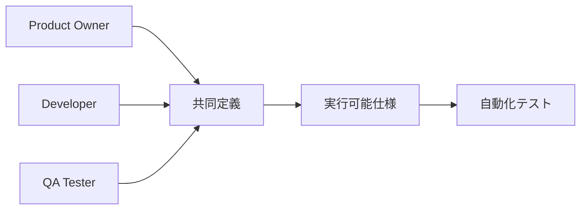

# BDD（振る舞い駆動開発）仕様書
## ドクターカー・オールインワンアプリケーション

### 1. 概要

本ドキュメントは、振る舞い駆動開発（BDD）アプローチを用いてドクターカーアプリの機能を定義・検証するための実行可能仕様書です。Given-When-Thenフォーマットを使用し、ステークホルダーと開発チームが共通理解できる形で要件を記述します。

### 2. BDD基本原則

#### 2.1. Three Amigos プロセス



#### 2.2. Given-When-Then フォーマット

- **Given** (前提条件): テスト実行前の状態・コンテキスト
- **When** (実行条件): ユーザーが行うアクション
- **Then** (期待結果): システムの振る舞いや結果

### 3. ユーザーストーリーと受け入れ条件

#### 3.1. Epic: ドクターカー隊員の現場対応

##### User Story 1: 緊急出動への対応

```gherkin
Feature: 緊急出動対応
  As a ドクターカー隊員
  I want to 出動要請に迅速に対応する
  So that 患者の救命率を向上できる

  Background:
    Given ドクターカー隊員として認証済み
    And 出動可能な状態である

  Scenario: 新規出動要請の確認
    Given システムに新しい出動要請が登録されている
    When 事案一覧画面を表示する
    Then 新規出動要請が最上位に表示される
    And 事案のステータスが「出動中」と表示される
    And 患者の基本情報が表示される

  Scenario: 出動要請への応答
    Given 新規出動要請が表示されている
    When 対象の出動要請を選択する
    Then 事案詳細画面に遷移する
    And 現場と病院の位置がマップに表示される
    And 「現場到着」ボタンが有効になる

  Scenario: 現場到着の報告
    Given 事案詳細画面を表示している
    And 事案ステータスが「出動中」である
    When 「現場到着」ボタンを押す
    Then 事案ステータスが「現場活動中」に変更される
    And 病院に自動的に到着通知が送信される
    And バイタル入力機能が有効になる
```

##### User Story 2: 患者バイタルサイン記録

```gherkin
Feature: 患者バイタルサイン記録
  As a ドクターカー隊員
  I want to 患者のバイタルサインを簡単に入力・記録する
  So that 病院が受け入れ準備を適切に行える

  Background:
    Given ドクターカー隊員として認証済み
    And 事案詳細画面を表示している
    And 事案ステータスが「現場活動中」である

  Scenario: バイタルサイン入力フォームの表示
    Given 患者情報タイムライン画面を表示している
    When 「バイタル入力」ボタンを押す
    Then バイタル入力モーダルが表示される
    And 心拍数入力欄が表示される
    And 血圧（収縮期・拡張期）入力欄が表示される
    And 酸素飽和度入力欄が表示される

  Scenario: 正常なバイタルサインの入力
    Given バイタル入力モーダルが表示されている
    When 心拍数に「90」を入力する
    And 収縮期血圧に「120」を入力する
    And 拡張期血圧に「80」を入力する
    And 酸素飽和度に「98」を入力する
    And 「保存」ボタンを押す
    Then バイタルデータが正常に保存される
    And モーダルが閉じる
    And タイムラインに新しいバイタル記録が表示される
    And 記録時刻が自動的に設定される

  Scenario: 異常値のバイタルサイン入力
    Given バイタル入力モーダルが表示されている
    When 心拍数に「250」を入力する  # 正常範囲外
    And 「保存」ボタンを押す
    Then 「心拍数は40-200の範囲で入力してください」エラーが表示される
    And データは保存されない
    And モーダルは開いたまま

  Scenario: リアルタイムデータ同期の確認
    Given ドクターカー隊員がバイタルを入力した
    When 病院スタッフが同じ事案を表示している
    Then 3秒以内に新しいバイタルデータが反映される
    And タイムラインが自動的に更新される
```

##### User Story 3: 処置記録の管理

```gherkin
Feature: 処置記録管理
  As a ドクターカー隊員
  I want to 実施した処置を迅速に記録する
  So that 医療記録の正確性を保ち病院での継続治療に役立てる

  Background:
    Given ドクターカー隊員として認証済み
    And 事案詳細画面を表示している
    And 事案ステータスが「現場活動中」である

  Scenario: 処置記録の入力
    Given 患者情報タイムライン画面を表示している
    When 「処置入力」ボタンを押す
    Then 処置入力モーダルが表示される
    And 処置名入力欄が表示される
    And 処置詳細入力欄が表示される

  Scenario: 標準的な処置記録の入力
    Given 処置入力モーダルが表示されている
    When 処置名に「静脈路確保」を入力する
    And 処置詳細に「右前腕に20G留置針」を入力する
    And 「保存」ボタンを押す
    Then 処置記録が正常に保存される
    And タイムラインに処置記録が追加される
    And 記録者名が自動的に設定される

  Scenario: 処置記録とバイタルの統合表示
    Given 複数のバイタルと処置が記録されている
    When タイムライン画面を表示する
    Then すべての記録が時系列で表示される
    And バイタル記録と処置記録が区別して表示される
    And 最新の記録が上部に表示される
```

#### 3.2. Epic: 病院スタッフの受け入れ準備

##### User Story 4: リアルタイム情報監視

```gherkin
Feature: リアルタイム患者情報監視
  As a 病院スタッフ
  I want to ドクターカーからの患者情報をリアルタイムで確認する
  So that 適切な受け入れ準備を行える

  Background:
    Given 病院スタッフとして認証済み
    And 進行中の事案が存在する

  Scenario: ダッシュボードでの情報確認
    Given 事案一覧画面を表示している
    When 進行中の事案を選択する
    Then 事案詳細画面が表示される
    And 患者の最新バイタルサインが表示される
    And ドクターカーの現在位置が地図上に表示される
    And 到着予定時刻が表示される

  Scenario: バイタルサインの継続監視
    Given 事案詳細画面を表示している
    When ドクターカー隊員が新しいバイタルを入力する
    Then 5秒以内に画面が自動更新される
    And 新しいバイタルデータがハイライト表示される
    And 異常値の場合は警告色で表示される

  Scenario: 危険なバイタル値の警告
    Given 患者のバイタル監視中
    When 心拍数が200を超える値が入力される
    Then 画面に警告メッセージが表示される
    And バイタル値が赤色でハイライトされる
    And 音声通知が発生する（設定されている場合）
```

##### User Story 5: チーム間コミュニケーション

```gherkin
Feature: チーム間リアルタイムコミュニケーション
  As a 病院スタッフ or ドクターカー隊員
  I want to リアルタイムでメッセージを交換する
  So that 効率的な連携により患者ケアの質を向上できる

  Background:
    Given ユーザーとして認証済み
    And 事案詳細画面のチャットエリアを表示している

  Scenario: 基本的なメッセージ送信
    Given チャット入力欄が表示されている
    When 「CT準備完了しました」とメッセージを入力する
    And 「送信」ボタンを押す
    Then メッセージが送信される
    And 入力欄がクリアされる
    And 送信したメッセージがチャット履歴に表示される

  Scenario: 定型文メッセージの送信
    Given チャットエリアを表示している
    When 「受け入れ準備完了」定型文ボタンを押す
    Then 該当メッセージが自動的に送信される
    And チャット履歴に追加される
    And 相手に即座に配信される

  Scenario: メッセージの受信と表示
    Given 他のユーザーがメッセージを送信した
    When チャットエリアを表示している
    Then 3秒以内に新しいメッセージが表示される
    And 送信者名と送信時刻が表示される
    And 自分のメッセージと他者のメッセージが区別される

  Scenario: チャット履歴の確認
    Given 複数のメッセージが交換されている
    When チャット画面をスクロールする
    Then 過去のメッセージ履歴が時系列で表示される
    And メッセージの送信者が明確に識別できる
    And タイムスタンプが適切に表示される
```

#### 3.3. Epic: 位置情報・搬送管理

##### User Story 6: GPS追跡と到着予測

```gherkin
Feature: GPS位置追跡と到着予測
  As a 病院スタッフ
  I want to ドクターカーの現在位置と到着予定を把握する
  So that 受け入れタイミングを最適化できる

  Background:
    Given 病院スタッフとして認証済み
    And ドクターカーが搬送中の事案がある

  Scenario: リアルタイム位置追跡
    Given 事案詳細のマップ画面を表示している
    When ドクターカーが移動している
    Then 10秒間隔で位置情報が更新される
    And マップ上のドクターカーアイコンが移動する
    And 現在位置の精度情報が表示される

  Scenario: 到着予定時刻の計算
    Given ドクターカーが病院に向かっている
    When 現在位置と交通状況から計算する
    Then 到着予定時刻が表示される
    And 予定時刻は1分毎に更新される
    And 残り距離も併せて表示される

  Scenario: 搬送ルートの表示
    Given マップ画面を表示している
    When ドクターカーの搬送が開始される
    Then 現場から病院までのルートが表示される
    And ドクターカーの現在位置がハイライトされる
    And 推奨ルートが線で表示される
```

### 4. 技術的BDDシナリオ

#### 4.1. システム性能に関する振る舞い

```gherkin
Feature: システムレスポンス性能
  As a ユーザー
  I want to システムが迅速に応答する
  So that 緊急時の対応に支障をきたさない

  Scenario: ページ読み込み時間
    Given インターネット接続が正常
    When 事案一覧ページにアクセスする
    Then 2秒以内にページが表示される
    And 必要なデータが全て読み込まれる

  Scenario: リアルタイムデータ更新
    Given 複数ユーザーが同じ事案を監視している
    When 一人のユーザーがデータを更新する
    Then 3秒以内に他のユーザーの画面が更新される
    And データの不整合が発生しない

  Scenario: オフライン対応
    Given ネットワーク接続が一時的に切断された
    When ユーザーがデータ入力を試みる
    Then 「オフラインです」メッセージが表示される
    And 入力データは一時保存される
    And 接続復旧時に自動同期される
```

#### 4.2. セキュリティに関する振る舞い

```gherkin
Feature: データセキュリティ
  As a システム管理者
  I want to 患者データを適切に保護する
  So that プライバシーとセキュリティを確保できる

  Scenario: 認証期限切れの処理
    Given ユーザーがログイン済み
    When 認証トークンが期限切れになる
    Then 自動的にログイン画面にリダイレクトする
    And 「セッションが期限切れです」メッセージが表示される
    And 入力中のデータは安全に保存される

  Scenario: 権限に基づくアクセス制御
    Given 病院スタッフとしてログイン済み
    When ドクターカー専用機能にアクセスしようとする
    Then 「権限がありません」メッセージが表示される
    And 機能へのアクセスが拒否される
    And ログが記録される

  Scenario: データ暗号化の確認
    Given ユーザーがデータを送信する
    When ネットワーク通信が発生する
    Then 全ての通信がHTTPS暗号化される
    And センシティブデータは追加暗号化される
```

### 5. BDDテスト実装

#### 5.1. Cucumber.js設定

```javascript
// cucumber.config.js
module.exports = {
  default: {
    require: [
      'src/test/step-definitions/**/*.ts',
      'src/test/support/**/*.ts'
    ],
    format: [
      'progress-bar',
      'json:reports/cucumber_report.json',
      'html:reports/cucumber_report.html'
    ],
    formatOptions: {
      snippetInterface: 'async-await'
    },
    publishQuiet: true
  }
};
```

#### 5.2. ステップ定義実装例

```typescript
// src/test/step-definitions/auth-steps.ts
import { Given, When, Then } from '@cucumber/cucumber';
import { expect } from '@playwright/test';

Given('ドクターカー隊員として認証済み', async function() {
  await this.page.goto('/login');
  await this.page.click('[data-testid="demo-doctor-login"]');
  await expect(this.page).toHaveURL('/cases');
  
  // ユーザー情報をコンテキストに保存
  this.userRole = 'doctor_car';
  this.userId = 'demo-doctor-001';
});

When('事案一覧画面を表示する', async function() {
  await this.page.goto('/cases');
  await expect(this.page.locator('[data-testid="case-list"]')).toBeVisible();
});

Then('新規出動要請が最上位に表示される', async function() {
  const firstCase = this.page.locator('[data-testid="case-item"]').first();
  await expect(firstCase).toBeVisible();
  
  const status = await firstCase.locator('[data-testid="case-status"]').textContent();
  expect(status).toBe('出動中');
});
```

```typescript
// src/test/step-definitions/vital-steps.ts
import { Given, When, Then } from '@cucumber/cucumber';

When('心拍数に{string}を入力する', async function(heartRate: string) {
  await this.page.fill('[data-testid="hr-input"]', heartRate);
});

When('収縮期血圧に{string}を入力する', async function(systolic: string) {
  await this.page.fill('[data-testid="bp-s-input"]', systolic);
});

Then('バイタルデータが正常に保存される', async function() {
  // APIレスポンスの確認
  await this.page.waitForResponse(response => 
    response.url().includes('/vitals') && response.status() === 200
  );
  
  // UIの更新確認
  await expect(this.page.locator('[data-testid="save-success-message"]')).toBeVisible();
});

Then('{string}エラーが表示される', async function(errorMessage: string) {
  await expect(this.page.locator('[data-testid="error-message"]')).toContainText(errorMessage);
});
```

#### 5.3. ページオブジェクトパターン

```typescript
// src/test/page-objects/CaseDetailPage.ts
export class CaseDetailPage {
  constructor(private page: Page) {}
  
  async openVitalForm() {
    await this.page.click('[data-testid="add-vital-button"]');
    await expect(this.page.locator('[data-testid="vital-form-modal"]')).toBeVisible();
  }
  
  async enterVitalSigns(vitals: {hr: string, bp_s: string, bp_d: string, spo2: string}) {
    await this.page.fill('[data-testid="hr-input"]', vitals.hr);
    await this.page.fill('[data-testid="bp-s-input"]', vitals.bp_s);
    await this.page.fill('[data-testid="bp-d-input"]', vitals.bp_d);
    await this.page.fill('[data-testid="spo2-input"]', vitals.spo2);
  }
  
  async saveVitalSigns() {
    await this.page.click('[data-testid="save-vital-button"]');
  }
  
  async getLatestVitalRecord() {
    return await this.page.locator('[data-testid="vital-item"]').first().textContent();
  }
}
```

### 6. 受け入れテスト自動化

#### 6.1. 継続的なBDD実行

```yaml
# .github/workflows/bdd-tests.yml
name: BDD Acceptance Tests

on:
  pull_request:
    branches: [main]
  schedule:
    - cron: '0 2 * * *'  # 毎日午前2時

jobs:
  bdd-tests:
    runs-on: ubuntu-latest
    steps:
      - uses: actions/checkout@v3
      
      - name: Setup Node.js
        uses: actions/setup-node@v3
        with:
          node-version: '18'
          
      - name: Install dependencies
        run: npm install
        
      - name: Start Firebase Emulator
        run: npm run emulator &
        
      - name: Start Application
        run: npm run dev &
        
      - name: Wait for services
        run: sleep 30
        
      - name: Run BDD Tests
        run: npm run test:bdd
        
      - name: Generate BDD Report
        run: npm run test:bdd:report
        
      - name: Upload BDD Results
        uses: actions/upload-artifact@v3
        with:
          name: bdd-test-results
          path: reports/
```

#### 6.2. BDD報告書生成

```typescript
// scripts/generate-bdd-report.ts
import { generateCucumberReport } from './cucumber-report-generator';

async function generateReport() {
  const reportData = {
    features: await loadFeatureFiles(),
    scenarios: await loadTestResults(),
    coverage: await calculateCoverage()
  };
  
  await generateCucumberReport(reportData, {
    outputPath: 'reports/bdd-report.html',
    includeScreenshots: true,
    includeStepDefinitions: true
  });
}
```

### 7. BDD実践ガイドライン

#### 7.1. 効果的なシナリオ作成

```gherkin
# ✅ Good: 具体的で検証可能
Scenario: 異常な心拍数値の入力検証
  Given バイタル入力フォームが表示されている
  When 心拍数に「250」を入力する
  And 「保存」ボタンを押す
  Then 「心拍数は40-200の範囲で入力してください」エラーが表示される
  And フォームの値は保存されない

# ❌ Bad: 曖昧で検証困難
Scenario: バイタル入力のテスト
  Given フォームがある
  When 何かを入力する
  Then うまく動く
```

#### 7.2. ステークホルダーレビュープロセス

```markdown
## BDD Review Checklist

### Business Requirements
- [ ] シナリオがビジネス価値を明確に表現している
- [ ] ユーザーの実際の行動を反映している
- [ ] 受け入れ条件が完全に定義されている

### Technical Implementation  
- [ ] 全てのステップが自動化されている
- [ ] テストデータが適切に設定されている
- [ ] 実行時間が合理的である

### Quality Assurance
- [ ] ハッピーパスとエラーケースが網羅されている
- [ ] エッジケースが考慮されている
- [ ] 性能要件が含まれている
```

### 8. BDD管理とメンテナンス

#### 8.1. 実行可能仕様の管理

```typescript
// src/test/bdd-management/feature-tracker.ts
export class FeatureTracker {
  static async validateFeatureCoverage() {
    const features = await this.loadAllFeatures();
    const implementedSteps = await this.getImplementedSteps();
    
    const coverage = features.map(feature => ({
      name: feature.name,
      scenarios: feature.scenarios.length,
      implemented: this.countImplementedScenarios(feature, implementedSteps),
      coverage: this.calculateCoverage(feature, implementedSteps)
    }));
    
    return coverage;
  }
}
```

#### 8.2. Living Documentation

```typescript
// scripts/generate-living-docs.ts
async function generateLivingDocumentation() {
  const features = await loadFeatures();
  const testResults = await loadLatestTestResults();
  
  const documentation = {
    businessRules: extractBusinessRules(features),
    userJourneys: mapUserJourneys(features),
    apiContracts: generateApiDocumentation(features),
    testCoverage: calculateFeatureCoverage(testResults)
  };
  
  await generateMarkdownDocs(documentation);
  await generateInteractiveDocs(documentation);
}
```

このBDD仕様書により、技術チームとビジネスステークホルダーが共通の理解を持ち、実行可能な仕様として機能要件を管理できます。