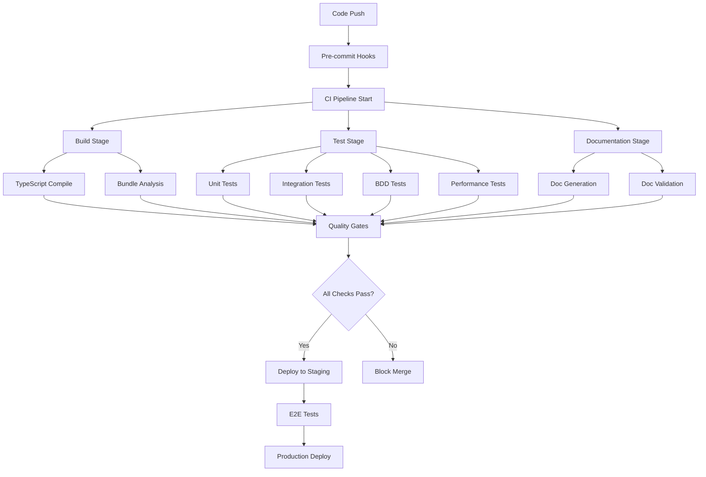

# 継続的インテグレーション仕様書
## ドクターカー・オールインワンアプリケーション

### 1. 概要

本ドキュメントは、TDD+DDD開発プロセスを支援する継続的インテグレーション（CI/CD）システムの詳細仕様を定義します。テスト自動化、品質ゲート、ドキュメント自動生成・検証プロセスを包括的に説明し、高品質なソフトウェア開発を継続的に支援します。

### 2. CI/CDアーキテクチャ

#### 2.1. パイプライン概要



#### 2.2. ステージ別責務

| ステージ | 目的 | 実行時間目標 | 失敗時アクション |
|---------|------|-------------|-----------------|
| **Build** | コンパイル・バンドル | 2分以内 | 即座にフィードバック |
| **Test** | 品質検証 | 5分以内 | 詳細レポート生成 |
| **Documentation** | ドキュメント同期検証 | 3分以内 | 不整合箇所の特定 |
| **Quality Gates** | 品質基準チェック | 1分以内 | 具体的な改善提案 |

### 3. GitHub Actions ワークフロー

#### 3.1. メインCI パイプライン

```yaml
# .github/workflows/ci.yml
name: Continuous Integration

on:
  push:
    branches: [main, develop]
  pull_request:
    branches: [main]
  schedule:
    - cron: '0 2 * * *'  # 毎日午前2時に実行

env:
  NODE_VERSION: '18'
  FIREBASE_PROJECT_ID: 'doctorcar-test'

jobs:
  setup:
    runs-on: ubuntu-latest
    outputs:
      cache-key: ${{ steps.cache-key.outputs.key }}
    steps:
      - uses: actions/checkout@v4
      
      - name: Setup Node.js
        uses: actions/setup-node@v4
        with:
          node-version: ${{ env.NODE_VERSION }}
          cache: 'npm'
      
      - name: Generate cache key
        id: cache-key
        run: echo "key=node-modules-${{ hashFiles('**/package-lock.json') }}" >> $GITHUB_OUTPUT
      
      - name: Cache dependencies
        uses: actions/cache@v3
        with:
          path: node_modules
          key: ${{ steps.cache-key.outputs.key }}
          restore-keys: node-modules-
      
      - name: Install dependencies
        run: npm ci

  build:
    needs: setup
    runs-on: ubuntu-latest
    steps:
      - uses: actions/checkout@v4
      
      - name: Setup Node.js
        uses: actions/setup-node@v4
        with:
          node-version: ${{ env.NODE_VERSION }}
          cache: 'npm'
      
      - name: Restore dependencies
        uses: actions/cache@v3
        with:
          path: node_modules
          key: ${{ needs.setup.outputs.cache-key }}
      
      - name: TypeScript type check
        run: npm run type-check
      
      - name: Build application
        run: npm run build
      
      - name: Bundle size analysis
        run: |
          npm run build:analyze
          node scripts/check-bundle-size.js
      
      - name: Upload build artifacts
        uses: actions/upload-artifact@v3
        with:
          name: build-dist
          path: dist/
          retention-days: 7

  test-unit:
    needs: setup
    runs-on: ubuntu-latest
    steps:
      - uses: actions/checkout@v4
      
      - name: Setup Node.js
        uses: actions/setup-node@v4
        with:
          node-version: ${{ env.NODE_VERSION }}
          cache: 'npm'
      
      - name: Restore dependencies
        uses: actions/cache@v3
        with:
          path: node_modules
          key: ${{ needs.setup.outputs.cache-key }}
      
      - name: Run unit tests
        run: npm run test:ci -- --coverage --maxWorkers=2
      
      - name: Upload coverage reports
        uses: codecov/codecov-action@v3
        with:
          file: ./coverage/lcov.info
          flags: unittests
          name: unit-test-coverage
      
      - name: Coverage quality gate
        run: |
          node scripts/check-coverage-threshold.js \
            --threshold-lines=90 \
            --threshold-functions=90 \
            --threshold-branches=85

  test-integration:
    needs: setup
    runs-on: ubuntu-latest
    services:
      firebase-emulator:
        image: andreysenov/firebase-tools:latest
        ports:
          - 4000:4000
          - 5000:5000
          - 8080:8080
          - 9099:9099
        options: --health-cmd="curl -f http://localhost:4000 || exit 1" --health-interval=30s --health-timeout=10s --health-retries=3
    
    steps:
      - uses: actions/checkout@v4
      
      - name: Setup Node.js
        uses: actions/setup-node@v4
        with:
          node-version: ${{ env.NODE_VERSION }}
          cache: 'npm'
      
      - name: Restore dependencies
        uses: actions/cache@v3
        with:
          path: node_modules
          key: ${{ needs.setup.outputs.cache-key }}
      
      - name: Start Firebase Emulators
        run: |
          npm install -g firebase-tools
          firebase emulators:start --only auth,firestore --project=${{ env.FIREBASE_PROJECT_ID }} &
          sleep 30
      
      - name: Run integration tests
        run: npm run test:integration
        env:
          FIREBASE_AUTH_EMULATOR_HOST: localhost:9099
          FIRESTORE_EMULATOR_HOST: localhost:8080
      
      - name: Upload test results
        uses: actions/upload-artifact@v3
        if: always()
        with:
          name: integration-test-results
          path: test-results/

  test-bdd:
    needs: setup
    runs-on: ubuntu-latest
    steps:
      - uses: actions/checkout@v4
      
      - name: Setup Node.js
        uses: actions/setup-node@v4
        with:
          node-version: ${{ env.NODE_VERSION }}
          cache: 'npm'
      
      - name: Restore dependencies
        uses: actions/cache@v3
        with:
          path: node_modules
          key: ${{ needs.setup.outputs.cache-key }}
      
      - name: Install Playwright
        run: npx playwright install
      
      - name: Start application
        run: |
          npm run build
          npm run preview &
          sleep 10
      
      - name: Run BDD tests
        run: npm run test:bdd
      
      - name: Upload BDD results
        uses: actions/upload-artifact@v3
        if: always()
        with:
          name: bdd-test-results
          path: reports/
      
      - name: Generate BDD report
        if: always()
        run: |
          npm run test:bdd:report
          echo "BDD_REPORT_URL=https://github.com/${{ github.repository }}/actions/runs/${{ github.run_id }}" >> $GITHUB_ENV

  documentation:
    needs: setup
    runs-on: ubuntu-latest
    steps:
      - uses: actions/checkout@v4
      
      - name: Setup Node.js
        uses: actions/setup-node@v4
        with:
          node-version: ${{ env.NODE_VERSION }}
          cache: 'npm'
      
      - name: Restore dependencies
        uses: actions/cache@v3
        with:
          path: node_modules
          key: ${{ needs.setup.outputs.cache-key }}
      
      - name: Validate API documentation
        run: npm run docs:validate:api
      
      - name: Validate BDD scenarios
        run: npm run docs:validate:bdd
      
      - name: Check documentation sync
        run: node scripts/check-docs-sync.js
      
      - name: Generate documentation
        run: npm run docs:generate
      
      - name: Upload documentation
        uses: actions/upload-artifact@v3
        with:
          name: generated-docs
          path: docs/generated/

  quality-gates:
    needs: [build, test-unit, test-integration, test-bdd, documentation]
    runs-on: ubuntu-latest
    if: always()
    steps:
      - uses: actions/checkout@v4
      
      - name: Download all artifacts
        uses: actions/download-artifact@v3
      
      - name: Quality gate analysis
        run: |
          node scripts/quality-gate-analysis.js \
            --build-status="${{ needs.build.result }}" \
            --unit-test-status="${{ needs.test-unit.result }}" \
            --integration-test-status="${{ needs.test-integration.result }}" \
            --bdd-test-status="${{ needs.test-bdd.result }}" \
            --documentation-status="${{ needs.documentation.result }}"
      
      - name: Security scan
        run: npm audit --audit-level=moderate
      
      - name: Dependency check
        run: npm run deps:check
      
      - name: Performance budget check
        run: node scripts/check-performance-budget.js
      
      - name: Update quality metrics
        run: node scripts/update-quality-metrics.js
      
      - name: Generate quality report
        run: node scripts/generate-quality-report.js
      
      - name: Comment PR with results
        if: github.event_name == 'pull_request'
        uses: actions/github-script@v6
        with:
          script: |
            const fs = require('fs');
            const report = fs.readFileSync('quality-report.md', 'utf8');
            
            github.rest.issues.createComment({
              issue_number: context.issue.number,
              owner: context.repo.owner,
              repo: context.repo.repo,
              body: report
            });
```

#### 3.2. デプロイメント パイプライン

```yaml
# .github/workflows/deploy.yml
name: Deploy

on:
  push:
    branches: [main]
  release:
    types: [published]

jobs:
  deploy-staging:
    runs-on: ubuntu-latest
    if: github.ref == 'refs/heads/main'
    environment: staging
    steps:
      - uses: actions/checkout@v4
      
      - name: Setup Node.js
        uses: actions/setup-node@v4
        with:
          node-version: '18'
          cache: 'npm'
      
      - name: Install dependencies
        run: npm ci
      
      - name: Build for staging
        run: npm run build:staging
        env:
          VITE_FIREBASE_PROJECT_ID: ${{ secrets.FIREBASE_PROJECT_ID_STAGING }}
          VITE_FIREBASE_API_KEY: ${{ secrets.FIREBASE_API_KEY_STAGING }}
      
      - name: Deploy to Firebase Hosting (Staging)
        uses: FirebaseExtended/action-hosting-deploy@v0
        with:
          repoToken: ${{ secrets.GITHUB_TOKEN }}
          firebaseServiceAccount: ${{ secrets.FIREBASE_SERVICE_ACCOUNT_STAGING }}
          projectId: ${{ secrets.FIREBASE_PROJECT_ID_STAGING }}
      
      - name: Run E2E tests on staging
        run: npm run test:e2e:staging
        env:
          BASE_URL: ${{ steps.deploy.outputs.details_url }}
      
      - name: Performance testing
        run: npm run test:performance:staging
      
      - name: Security testing
        run: npm run test:security:staging

  deploy-production:
    runs-on: ubuntu-latest
    if: github.event_name == 'release'
    environment: production
    needs: deploy-staging
    steps:
      - uses: actions/checkout@v4
      
      - name: Setup Node.js
        uses: actions/setup-node@v4
        with:
          node-version: '18'
          cache: 'npm'
      
      - name: Install dependencies
        run: npm ci
      
      - name: Build for production
        run: npm run build:production
        env:
          VITE_FIREBASE_PROJECT_ID: ${{ secrets.FIREBASE_PROJECT_ID_PROD }}
          VITE_FIREBASE_API_KEY: ${{ secrets.FIREBASE_API_KEY_PROD }}
      
      - name: Deploy to Firebase Hosting (Production)
        uses: FirebaseExtended/action-hosting-deploy@v0
        with:
          repoToken: ${{ secrets.GITHUB_TOKEN }}
          firebaseServiceAccount: ${{ secrets.FIREBASE_SERVICE_ACCOUNT_PROD }}
          projectId: ${{ secrets.FIREBASE_PROJECT_ID_PROD }}
      
      - name: Create deployment notification
        run: |
          curl -X POST -H 'Content-type: application/json' \
            --data '{"text":"🚀 Doctor Car App deployed to production: ${{ github.event.release.tag_name }}"}' \
            ${{ secrets.SLACK_WEBHOOK_URL }}
```

### 4. 品質ゲート詳細

#### 4.1. 自動品質チェック

```typescript
// scripts/quality-gate-analysis.js
export class QualityGateAnalysis {
  static async runAnalysis(buildResults: BuildResults) {
    const results = {
      overall: 'PASS',
      gates: [] as QualityGate[]
    };
    
    // コードカバレッジゲート
    const coverageGate = await this.checkCoverageGate();
    results.gates.push(coverageGate);
    
    // テスト品質ゲート
    const testQualityGate = await this.checkTestQualityGate();
    results.gates.push(testQualityGate);
    
    // ドキュメント同期ゲート
    const docSyncGate = await this.checkDocumentationSyncGate();
    results.gates.push(docSyncGate);
    
    // パフォーマンスゲート
    const performanceGate = await this.checkPerformanceGate();
    results.gates.push(performanceGate);
    
    // セキュリティゲート
    const securityGate = await this.checkSecurityGate();
    results.gates.push(securityGate);
    
    // 総合判定
    const failedGates = results.gates.filter(gate => gate.status === 'FAIL');
    if (failedGates.length > 0) {
      results.overall = 'FAIL';
    }
    
    return results;
  }
  
  private static async checkCoverageGate(): Promise<QualityGate> {
    const coverage = await this.parseCoverageReport();
    
    const thresholds = {
      lines: 90,
      functions: 90,
      branches: 85,
      statements: 90
    };
    
    const failures = [];
    for (const [metric, threshold] of Object.entries(thresholds)) {
      if (coverage[metric] < threshold) {
        failures.push(`${metric}: ${coverage[metric]}% < ${threshold}%`);
      }
    }
    
    return {
      name: 'Code Coverage',
      status: failures.length === 0 ? 'PASS' : 'FAIL',
      details: failures.length === 0 ? 'All coverage thresholds met' : failures.join(', '),
      metrics: coverage
    };
  }
  
  private static async checkTestQualityGate(): Promise<QualityGate> {
    const testResults = await this.parseTestResults();
    
    const criteria = {
      unitTestsPass: testResults.unit.passed === testResults.unit.total,
      integrationTestsPass: testResults.integration.passed === testResults.integration.total,
      bddTestsPass: testResults.bdd.passed === testResults.bdd.total,
      noFlakyTests: testResults.flaky.length === 0
    };
    
    const failures = [];
    if (!criteria.unitTestsPass) {
      failures.push(`Unit tests: ${testResults.unit.failed} failed`);
    }
    if (!criteria.integrationTestsPass) {
      failures.push(`Integration tests: ${testResults.integration.failed} failed`);
    }
    if (!criteria.bddTestsPass) {
      failures.push(`BDD tests: ${testResults.bdd.failed} failed`);
    }
    if (!criteria.noFlakyTests) {
      failures.push(`Flaky tests detected: ${testResults.flaky.length}`);
    }
    
    return {
      name: 'Test Quality',
      status: failures.length === 0 ? 'PASS' : 'FAIL',
      details: failures.length === 0 ? 'All tests passed' : failures.join(', '),
      metrics: testResults
    };
  }
  
  private static async checkDocumentationSyncGate(): Promise<QualityGate> {
    const syncResults = await this.checkDocumentationSync();
    
    return {
      name: 'Documentation Sync',
      status: syncResults.inSync ? 'PASS' : 'FAIL',
      details: syncResults.inSync ? 'Documentation is in sync' : syncResults.issues.join(', '),
      metrics: syncResults
    };
  }
}

interface QualityGate {
  name: string;
  status: 'PASS' | 'FAIL' | 'WARN';
  details: string;
  metrics: any;
}
```

#### 4.2. パフォーマンス監視

```typescript
// scripts/performance-monitoring.ts
export class PerformanceMonitoring {
  static async checkBundleSize() {
    const bundleAnalysis = await this.analyzeBundleSize();
    
    const budgets = {
      'index.js': 500 * 1024,  // 500KB
      'index.css': 50 * 1024,  // 50KB
      'vendor.js': 1024 * 1024 // 1MB
    };
    
    const violations = [];
    for (const [file, budget] of Object.entries(budgets)) {
      const actualSize = bundleAnalysis.files[file]?.size || 0;
      if (actualSize > budget) {
        violations.push({
          file,
          actualSize,
          budget,
          excess: actualSize - budget
        });
      }
    }
    
    return {
      passed: violations.length === 0,
      violations,
      analysis: bundleAnalysis
    };
  }
  
  static async runLighthouseAudit(url: string) {
    const lighthouse = await import('lighthouse');
    const chrome = await import('chrome-launcher');
    
    const chromeInstance = await chrome.launch({chromeFlags: ['--headless']});
    
    const options = {
      logLevel: 'info',
      output: 'json',
      onlyCategories: ['performance', 'accessibility', 'best-practices'],
      port: chromeInstance.port,
    };
    
    const runnerResult = await lighthouse.default(url, options);
    await chromeInstance.kill();
    
    const scores = {
      performance: runnerResult.lhr.categories.performance.score * 100,
      accessibility: runnerResult.lhr.categories.accessibility.score * 100,
      bestPractices: runnerResult.lhr.categories['best-practices'].score * 100
    };
    
    const thresholds = {
      performance: 80,
      accessibility: 90,
      bestPractices: 80
    };
    
    const failures = [];
    for (const [category, score] of Object.entries(scores)) {
      if (score < thresholds[category]) {
        failures.push(`${category}: ${score} < ${thresholds[category]}`);
      }
    }
    
    return {
      passed: failures.length === 0,
      scores,
      failures,
      report: runnerResult.lhr
    };
  }
}
```

### 5. ドキュメント自動生成・検証

#### 5.1. API ドキュメント自動生成

```typescript
// scripts/generate-api-docs.ts
export class APIDocumentationGenerator {
  static async generateFromCode() {
    const sourceFiles = await this.findSourceFiles('src/services/**/*.ts');
    const apiDocs = [];
    
    for (const file of sourceFiles) {
      const ast = await this.parseTypeScriptFile(file);
      const functions = this.extractExportedFunctions(ast);
      
      for (const func of functions) {
        const documentation = {
          name: func.name,
          description: this.extractJSDocDescription(func),
          parameters: this.extractParameters(func),
          returnType: this.extractReturnType(func),
          examples: this.extractExamples(func),
          throws: this.extractThrows(func)
        };
        
        apiDocs.push(documentation);
      }
    }
    
    await this.generateMarkdownDocs(apiDocs);
    await this.generateOpenAPISpec(apiDocs);
    
    return apiDocs;
  }
  
  static async validateAPIDocumentation() {
    const codeAPI = await this.extractAPIFromCode();
    const documentedAPI = await this.extractAPIFromDocumentation();
    
    const missingDocs = codeAPI.filter(api => 
      !documentedAPI.find(doc => doc.name === api.name)
    );
    
    const outdatedDocs = documentedAPI.filter(doc => {
      const codeFunc = codeAPI.find(api => api.name === doc.name);
      return codeFunc && !this.signaturesMatch(doc, codeFunc);
    });
    
    const extraDocs = documentedAPI.filter(doc =>
      !codeAPI.find(api => api.name === doc.name)
    );
    
    return {
      isValid: missingDocs.length === 0 && outdatedDocs.length === 0 && extraDocs.length === 0,
      missingDocs,
      outdatedDocs,
      extraDocs
    };
  }
}
```

#### 5.2. BDD ドキュメント生成

```typescript
// scripts/generate-bdd-docs.ts
export class BDDDocumentationGenerator {
  static async generateExecutableSpecification() {
    const featureFiles = await this.findFeatureFiles('src/test/features/**/*.feature');
    const stepDefinitions = await this.findStepDefinitions('src/test/step-definitions/**/*.ts');
    
    const documentation = {
      features: [],
      coverage: await this.calculateBDDCoverage(featureFiles, stepDefinitions)
    };
    
    for (const featureFile of featureFiles) {
      const feature = await this.parseFeatureFile(featureFile);
      const implementedSteps = this.findImplementedSteps(feature, stepDefinitions);
      
      documentation.features.push({
        name: feature.name,
        description: feature.description,
        scenarios: feature.scenarios.map(scenario => ({
          name: scenario.name,
          steps: scenario.steps,
          implemented: this.isScenarioImplemented(scenario, implementedSteps),
          automationStatus: this.getAutomationStatus(scenario, implementedSteps)
        }))
      });
    }
    
    await this.generateLivingDocumentation(documentation);
    return documentation;
  }
  
  static async validateBDDCoverage() {
    const scenarios = await this.getAllBDDScenarios();
    const implementations = await this.getAllStepImplementations();
    
    const coverage = scenarios.map(scenario => ({
      scenario: scenario.name,
      steps: scenario.steps.map(step => ({
        text: step.text,
        implemented: implementations.some(impl => impl.matches(step.text)),
        implementation: implementations.find(impl => impl.matches(step.text))
      }))
    }));
    
    const coveragePercentage = this.calculateCoveragePercentage(coverage);
    
    return {
      passed: coveragePercentage >= 90,
      percentage: coveragePercentage,
      coverage,
      uncoveredScenarios: coverage.filter(c => 
        c.steps.some(s => !s.implemented)
      )
    };
  }
}
```

### 6. 通知とレポート

#### 6.1. Slack 通知統合

```typescript
// scripts/slack-notifications.ts
export class SlackNotifications {
  static async sendBuildStatus(buildResult: BuildResult) {
    const webhook = process.env.SLACK_WEBHOOK_URL;
    if (!webhook) return;
    
    const color = buildResult.success ? 'good' : 'danger';
    const emoji = buildResult.success ? '✅' : '❌';
    
    const message = {
      attachments: [{
        color,
        title: `${emoji} Build ${buildResult.success ? 'Passed' : 'Failed'}`,
        text: `Branch: ${buildResult.branch}\nCommit: ${buildResult.commit}\n${buildResult.summary}`,
        fields: [
          {
            title: 'Tests',
            value: `Unit: ${buildResult.tests.unit.passed}/${buildResult.tests.unit.total}\nIntegration: ${buildResult.tests.integration.passed}/${buildResult.tests.integration.total}\nBDD: ${buildResult.tests.bdd.passed}/${buildResult.tests.bdd.total}`,
            short: true
          },
          {
            title: 'Coverage',
            value: `Lines: ${buildResult.coverage.lines}%\nFunctions: ${buildResult.coverage.functions}%`,
            short: true
          }
        ],
        actions: [{
          type: 'button',
          text: 'View Details',
          url: buildResult.detailsUrl
        }]
      }]
    };
    
    await fetch(webhook, {
      method: 'POST',
      headers: { 'Content-Type': 'application/json' },
      body: JSON.stringify(message)
    });
  }
  
  static async sendQualityReport(qualityResult: QualityResult) {
    const webhook = process.env.SLACK_WEBHOOK_URL;
    if (!webhook) return;
    
    const failedGates = qualityResult.gates.filter(gate => gate.status === 'FAIL');
    const warningGates = qualityResult.gates.filter(gate => gate.status === 'WARN');
    
    if (failedGates.length === 0 && warningGates.length === 0) {
      return; // 問題なしの場合は通知しない
    }
    
    const color = failedGates.length > 0 ? 'danger' : 'warning';
    const emoji = failedGates.length > 0 ? '🚨' : '⚠️';
    
    const message = {
      attachments: [{
        color,
        title: `${emoji} Quality Gate Issues Detected`,
        fields: [
          ...failedGates.map(gate => ({
            title: `❌ ${gate.name}`,
            value: gate.details,
            short: false
          })),
          ...warningGates.map(gate => ({
            title: `⚠️ ${gate.name}`,
            value: gate.details,
            short: false
          }))
        ]
      }]
    };
    
    await fetch(webhook, {
      method: 'POST',
      headers: { 'Content-Type': 'application/json' },
      body: JSON.stringify(message)
    });
  }
}
```

#### 6.2. GitHub PR コメント自動生成

```typescript
// scripts/pr-comment-generator.ts
export class PRCommentGenerator {
  static async generateQualityReport(prNumber: number, qualityResults: QualityResult) {
    const report = this.buildQualityReportMarkdown(qualityResults);
    
    await this.postOrUpdateComment(prNumber, report);
  }
  
  private static buildQualityReportMarkdown(results: QualityResult): string {
    const overallStatus = results.overall === 'PASS' ? '✅ PASSED' : '❌ FAILED';
    
    let markdown = `## 📊 Quality Report - ${overallStatus}\n\n`;
    
    // サマリーテーブル
    markdown += '### Summary\n\n';
    markdown += '| Quality Gate | Status | Details |\n';
    markdown += '|--------------|--------|---------|\n';
    
    for (const gate of results.gates) {
      const statusEmoji = gate.status === 'PASS' ? '✅' : gate.status === 'FAIL' ? '❌' : '⚠️';
      markdown += `| ${gate.name} | ${statusEmoji} ${gate.status} | ${gate.details} |\n`;
    }
    
    // 詳細セクション
    if (results.gates.some(gate => gate.status !== 'PASS')) {
      markdown += '\n### Details\n\n';
      
      for (const gate of results.gates.filter(g => g.status !== 'PASS')) {
        markdown += `#### ${gate.name}\n\n`;
        markdown += `**Status:** ${gate.status}\n`;
        markdown += `**Details:** ${gate.details}\n\n`;
        
        if (gate.metrics) {
          markdown += '**Metrics:**\n';
          markdown += '```json\n';
          markdown += JSON.stringify(gate.metrics, null, 2);
          markdown += '\n```\n\n';
        }
      }
    }
    
    // 改善提案
    if (results.overall === 'FAIL') {
      markdown += '### 🔧 Suggested Actions\n\n';
      const suggestions = this.generateSuggestions(results);
      for (const suggestion of suggestions) {
        markdown += `- ${suggestion}\n`;
      }
    }
    
    markdown += '\n---\n';
    markdown += `*Generated by CI/CD pipeline at ${new Date().toISOString()}*`;
    
    return markdown;
  }
  
  private static generateSuggestions(results: QualityResult): string[] {
    const suggestions = [];
    
    const failedGates = results.gates.filter(gate => gate.status === 'FAIL');
    
    for (const gate of failedGates) {
      switch (gate.name) {
        case 'Code Coverage':
          suggestions.push('Add more unit tests to increase code coverage');
          suggestions.push('Review uncovered code paths and add appropriate tests');
          break;
        case 'Test Quality':
          suggestions.push('Fix failing tests before merging');
          suggestions.push('Review test failures and update test cases if needed');
          break;
        case 'Documentation Sync':
          suggestions.push('Update API documentation to match code changes');
          suggestions.push('Review and update BDD scenarios if behavior changed');
          break;
        case 'Performance':
          suggestions.push('Optimize bundle size by removing unused dependencies');
          suggestions.push('Review and optimize performance bottlenecks');
          break;
      }
    }
    
    return suggestions;
  }
}
```

### 7. 監視とメトリクス

#### 7.1. 品質メトリクス収集

```typescript
// scripts/metrics-collector.ts
export class MetricsCollector {
  static async collectDailyMetrics() {
    const metrics = {
      timestamp: new Date().toISOString(),
      build: await this.collectBuildMetrics(),
      test: await this.collectTestMetrics(),
      quality: await this.collectQualityMetrics(),
      deployment: await this.collectDeploymentMetrics()
    };
    
    await this.storeMetrics(metrics);
    await this.generateTrendAnalysis(metrics);
    
    return metrics;
  }
  
  private static async collectBuildMetrics() {
    return {
      totalBuilds: await this.countBuilds('1d'),
      successRate: await this.calculateBuildSuccessRate('1d'),
      averageBuildTime: await this.calculateAverageBuildTime('1d'),
      failureReasons: await this.analyzeBuildFailures('1d')
    };
  }
  
  private static async collectTestMetrics() {
    return {
      unitTests: {
        total: await this.countUnitTests(),
        passed: await this.countPassedUnitTests(),
        coverage: await this.getLatestCoverage()
      },
      integrationTests: {
        total: await this.countIntegrationTests(),
        passed: await this.countPassedIntegrationTests()
      },
      bddTests: {
        scenarios: await this.countBDDScenarios(),
        implemented: await this.countImplementedBDDScenarios(),
        coverage: await this.calculateBDDCoverage()
      }
    };
  }
  
  private static async collectQualityMetrics() {
    return {
      codeQuality: {
        eslintIssues: await this.countESLintIssues(),
        typeScriptErrors: await this.countTypeScriptErrors(),
        duplicatedCode: await this.measureCodeDuplication()
      },
      documentation: {
        apiCoverage: await this.calculateAPICoverage(),
        bddCoverage: await this.calculateBDDDocCoverage(),
        syncStatus: await this.checkDocumentationSync()
      },
      performance: {
        bundleSize: await this.measureBundleSize(),
        lighthouseScores: await this.getLatestLighthouseScores(),
        loadTime: await this.measureLoadTime()
      }
    };
  }
}
```

#### 7.2. ダッシュボード生成

```typescript
// scripts/dashboard-generator.ts
export class DashboardGenerator {
  static async generateQualityDashboard() {
    const metrics = await MetricsCollector.collectDailyMetrics();
    const trends = await this.calculateTrends(metrics);
    
    const dashboard = {
      summary: this.generateSummary(metrics),
      charts: {
        buildSuccess: this.generateBuildSuccessChart(trends.build),
        testCoverage: this.generateCoverageChart(trends.test),
        qualityGates: this.generateQualityGatesChart(trends.quality),
        performance: this.generatePerformanceChart(trends.performance)
      },
      alerts: this.generateAlerts(metrics),
      recommendations: this.generateRecommendations(metrics, trends)
    };
    
    await this.generateHTMLDashboard(dashboard);
    await this.generateSlackSummary(dashboard);
    
    return dashboard;
  }
  
  private static generateSummary(metrics: any) {
    return {
      buildHealth: {
        successRate: metrics.build.successRate,
        status: metrics.build.successRate >= 95 ? 'healthy' : 'degraded'
      },
      testHealth: {
        coverage: metrics.test.unitTests.coverage.lines,
        status: metrics.test.unitTests.coverage.lines >= 90 ? 'healthy' : 'degraded'
      },
      qualityHealth: {
        gatesPassing: metrics.quality.codeQuality.eslintIssues === 0,
        status: metrics.quality.codeQuality.eslintIssues === 0 ? 'healthy' : 'degraded'
      }
    };
  }
}
```

### 8. 環境別設定

#### 8.1. 開発環境設定

```yaml
# .github/workflows/dev-environment.yml
name: Development Environment

on:
  workflow_dispatch:
  schedule:
    - cron: '0 9 * * 1-5'  # 平日午前9時

jobs:
  setup-dev-environment:
    runs-on: ubuntu-latest
    steps:
      - uses: actions/checkout@v4
      
      - name: Setup development Firebase project
        run: |
          firebase use dev
          firebase deploy --only firestore:rules,firestore:indexes
      
      - name: Seed test data
        run: |
          npm run test-data:seed:dev
      
      - name: Deploy to dev environment
        run: |
          npm run build:dev
          firebase deploy --only hosting:dev
      
      - name: Run smoke tests
        run: npm run test:smoke:dev

  cleanup-dev-environment:
    runs-on: ubuntu-latest
    if: github.event_name == 'schedule'
    steps:
      - name: Clean up old test data
        run: npm run test-data:cleanup:dev
      
      - name: Optimize Firestore
        run: npm run firestore:optimize:dev
```

#### 8.2. 本番環境監視

```yaml
# .github/workflows/production-monitoring.yml  
name: Production Monitoring

on:
  schedule:
    - cron: '*/15 * * * *'  # 15分毎

jobs:
  health-check:
    runs-on: ubuntu-latest
    steps:
      - name: Application health check
        run: |
          curl -f https://doctorcar-app.com/health || exit 1
      
      - name: Database connectivity check
        run: npm run check:database:connectivity
      
      - name: Performance monitoring
        run: |
          npm run lighthouse:production
          npm run performance:check:production
      
      - name: Security scanning
        run: npm run security:scan:production
      
      - name: Alert on failures
        if: failure()
        run: |
          node scripts/send-production-alert.js
```

この包括的なCI/CD仕様により、TDD+DDD開発プロセスを完全に自動化し、継続的な品質向上を実現できます。

<function_calls>
<invoke name="TodoWrite">
<parameter name="todos">[{"id": "1", "content": "\u30c6\u30b9\u30c8\u5148\u884c\u958b\u767a\u4ed5\u69d8\u66f8\u306e\u4f5c\u6210", "status": "completed", "priority": "high"}, {"id": "2", "content": "BDD\uff08\u632f\u308b\u821e\u3044\u99c6\u52d5\u958b\u767a\uff09\u4ed5\u69d8\u66f8\u306e\u4f5c\u6210", "status": "completed", "priority": "high"}, {"id": "3", "content": "\u30c6\u30b9\u30c8\u30c7\u30fc\u30bf\u30fb\u30e2\u30c3\u30af\u4ed5\u69d8\u66f8\u306e\u4f5c\u6210", "status": "completed", "priority": "medium"}, {"id": "4", "content": "TDD+DDD\u958b\u767a\u30ef\u30fc\u30af\u30d5\u30ed\u30fc\u4ed5\u69d8\u66f8\u306e\u4f5c\u6210", "status": "completed", "priority": "medium"}, {"id": "5", "content": "\u7d99\u7d9a\u7684\u30a4\u30f3\u30c6\u30b0\u30ec\u30fc\u30b7\u30e7\u30f3\u4ed5\u69d8\u66f8\u306e\u4f5c\u6210", "status": "completed", "priority": "low"}]