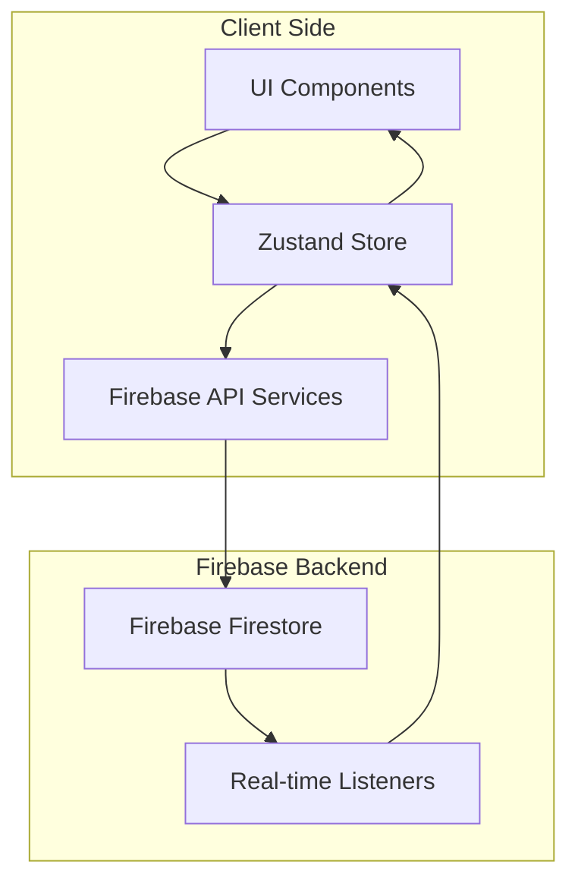
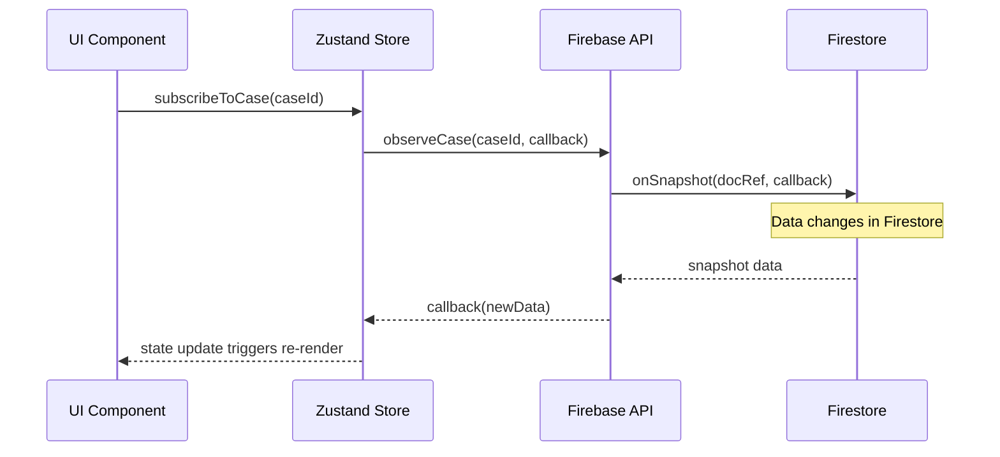
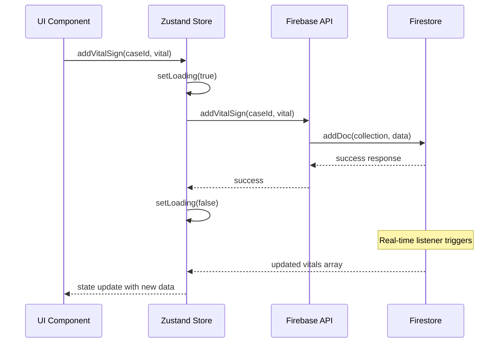

# データフロー・状態管理設計仕様書
## ドクターカー・オールインワンアプリケーション

### 1. 概要

本ドキュメントは、アプリケーションの状態管理とデータフローの詳細設計を定義します。
Zustand を使用したクライアントサイド状態管理と Firebase Firestore との連携によるリアルタイムデータ同期を実現します。

### 2. アーキテクチャ概要



### 3. 状態管理構成

#### 3.1. ストア構成

```
src/stores/
├── authStore.ts          # 認証状態管理
├── caseStore.ts          # 事案状態管理
├── vitalStore.ts         # バイタルサイン状態管理
├── messageStore.ts       # メッセージ状態管理
├── locationStore.ts      # 位置情報状態管理
├── uiStore.ts           # UI状態管理
└── index.ts             # ストア統合
```

### 4. 認証状態管理

#### 4.1. AuthStore

```typescript
// src/stores/authStore.ts

import { create } from 'zustand';
import { subscribeWithSelector } from 'zustand/middleware';
import { User } from 'firebase/auth';
import { AppUser } from '../types';

interface AuthState {
  // State
  currentUser: User | null;
  userInfo: AppUser | null;
  isAuthenticated: boolean;
  loading: boolean;
  error: string | null;
  
  // Actions
  setUser: (user: User | null) => void;
  setUserInfo: (userInfo: AppUser | null) => void;
  setLoading: (loading: boolean) => void;
  setError: (error: string | null) => void;
  login: (email: string, password: string) => Promise<void>;
  loginDemo: (role: 'doctor_car' | 'hospital') => Promise<void>;
  logout: () => Promise<void>;
  initialize: () => void;
}

/**
 * 認証状態管理ストア
 * 
 * 責務:
 * - Firebase Authentication状態の管理
 * - ユーザー情報の管理
 * - ログイン・ログアウト処理
 * - 認証状態の監視
 */
export const useAuthStore = create<AuthState>()(
  subscribeWithSelector((set, get) => ({
    // Initial State
    currentUser: null,
    userInfo: null,
    isAuthenticated: false,
    loading: true,
    error: null,
    
    // Actions
    setUser: (user) => {
      set({
        currentUser: user,
        isAuthenticated: !!user,
        loading: false
      });
    },
    
    setUserInfo: (userInfo) => {
      set({ userInfo });
    },
    
    setLoading: (loading) => {
      set({ loading });
    },
    
    setError: (error) => {
      set({ error });
    },
    
    login: async (email, password) => {
      set({ loading: true, error: null });
      try {
        const user = await loginUser(email, password);
        const userInfo = await getUserInfo(user.uid);
        set({
          currentUser: user,
          userInfo,
          isAuthenticated: true,
          loading: false
        });
      } catch (error) {
        const appError = handleFirebaseError(error);
        set({
          error: appError.message,
          loading: false
        });
        throw appError;
      }
    },
    
    loginDemo: async (role) => {
      set({ loading: true, error: null });
      try {
        const user = role === 'doctor_car' 
          ? await loginAsDoctorCarMember()
          : await loginAsHospitalStaff();
        const userInfo = await getUserInfo(user.uid);
        set({
          currentUser: user,
          userInfo,
          isAuthenticated: true,
          loading: false
        });
      } catch (error) {
        const appError = handleFirebaseError(error);
        set({
          error: appError.message,
          loading: false
        });
        throw appError;
      }
    },
    
    logout: async () => {
      set({ loading: true });
      try {
        await logoutUser();
        set({
          currentUser: null,
          userInfo: null,
          isAuthenticated: false,
          loading: false,
          error: null
        });
      } catch (error) {
        const appError = handleFirebaseError(error);
        set({
          error: appError.message,
          loading: false
        });
        throw appError;
      }
    },
    
    initialize: () => {
      // Firebase Auth状態変更の監視
      const unsubscribe = observeAuthState(async (user) => {
        if (user) {
          try {
            const userInfo = await getUserInfo(user.uid);
            set({
              currentUser: user,
              userInfo,
              isAuthenticated: true,
              loading: false
            });
          } catch (error) {
            console.error('ユーザー情報取得エラー:', error);
            set({
              currentUser: user,
              userInfo: null,
              isAuthenticated: true,
              loading: false
            });
          }
        } else {
          set({
            currentUser: null,
            userInfo: null,
            isAuthenticated: false,
            loading: false
          });
        }
      });
      
      // クリーンアップ関数を返す
      return unsubscribe;
    }
  }))
);
```

### 5. 事案状態管理

#### 5.1. CaseStore

```typescript
// src/stores/caseStore.ts

import { create } from 'zustand';
import { subscribeWithSelector } from 'zustand/middleware';
import { Case } from '../types';

interface CaseState {
  // State
  cases: Case[];
  currentCase: Case | null;
  loading: boolean;
  error: string | null;
  
  // Real-time listeners
  listeners: Map<string, () => void>;
  
  // Actions
  setCases: (cases: Case[]) => void;
  setCurrentCase: (case_: Case | null) => void;
  setLoading: (loading: boolean) => void;
  setError: (error: string | null) => void;
  
  // Async Actions
  loadCases: () => Promise<void>;
  loadCase: (caseId: string) => Promise<void>;
  updateCaseStatus: (caseId: string, status: Case['status']) => Promise<void>;
  
  // Real-time Actions
  subscribeToCase: (caseId: string) => void;
  unsubscribeFromCase: (caseId: string) => void;
  
  // Cleanup
  cleanup: () => void;
}

/**
 * 事案状態管理ストア
 * 
 * 責務:
 * - 事案一覧の管理
 * - 現在選択中の事案の管理
 * - 事案のリアルタイム監視
 * - 事案ステータスの更新
 */
export const useCaseStore = create<CaseState>()(
  subscribeWithSelector((set, get) => ({
    // Initial State
    cases: [],
    currentCase: null,
    loading: false,
    error: null,
    listeners: new Map(),
    
    // Actions
    setCases: (cases) => set({ cases }),
    
    setCurrentCase: (currentCase) => set({ currentCase }),
    
    setLoading: (loading) => set({ loading }),
    
    setError: (error) => set({ error }),
    
    // Async Actions
    loadCases: async () => {
      set({ loading: true, error: null });
      try {
        const cases = await getAllCases();
        set({ cases, loading: false });
      } catch (error) {
        const appError = handleFirebaseError(error);
        set({ error: appError.message, loading: false });
        throw appError;
      }
    },
    
    loadCase: async (caseId) => {
      set({ loading: true, error: null });
      try {
        const case_ = await getCaseById(caseId);
        set({ currentCase: case_, loading: false });
      } catch (error) {
        const appError = handleFirebaseError(error);
        set({ error: appError.message, loading: false });
        throw appError;
      }
    },
    
    updateCaseStatus: async (caseId, status) => {
      try {
        await updateCaseStatus(caseId, status);
        // リアルタイムリスナーが自動的に状態を更新
      } catch (error) {
        const appError = handleFirebaseError(error);
        set({ error: appError.message });
        throw appError;
      }
    },
    
    // Real-time Actions
    subscribeToCase: (caseId) => {
      const { listeners } = get();
      
      // 既存のリスナーがある場合は解除
      if (listeners.has(caseId)) {
        listeners.get(caseId)?.();
      }
      
      // 新しいリスナーを設定
      const unsubscribe = observeCase(caseId, (case_) => {
        set({ currentCase: case_ });
      });
      
      listeners.set(caseId, unsubscribe);
      set({ listeners: new Map(listeners) });
    },
    
    unsubscribeFromCase: (caseId) => {
      const { listeners } = get();
      
      if (listeners.has(caseId)) {
        listeners.get(caseId)?.();
        listeners.delete(caseId);
        set({ listeners: new Map(listeners) });
      }
    },
    
    cleanup: () => {
      const { listeners } = get();
      
      listeners.forEach((unsubscribe) => {
        unsubscribe();
      });
      
      set({ listeners: new Map() });
    }
  }))
);
```

### 6. バイタルサイン状態管理

#### 6.1. VitalStore

```typescript
// src/stores/vitalStore.ts

import { create } from 'zustand';
import { subscribeWithSelector } from 'zustand/middleware';
import { VitalSign, Treatment } from '../types';

interface VitalState {
  // State
  vitals: Record<string, VitalSign[]>;      // caseId -> VitalSign[]
  treatments: Record<string, Treatment[]>;   // caseId -> Treatment[]
  loading: boolean;
  error: string | null;
  
  // Real-time listeners
  listeners: Map<string, () => void>;
  
  // Actions
  setVitals: (caseId: string, vitals: VitalSign[]) => void;
  setTreatments: (caseId: string, treatments: Treatment[]) => void;
  setLoading: (loading: boolean) => void;
  setError: (error: string | null) => void;
  
  // Async Actions
  addVitalSign: (caseId: string, vital: Omit<VitalSign, 'id' | 'timestamp' | 'caseId'>) => Promise<void>;
  addTreatment: (caseId: string, treatment: Omit<Treatment, 'id' | 'timestamp' | 'caseId'>) => Promise<void>;
  
  // Real-time Actions
  subscribeToVitals: (caseId: string) => void;
  unsubscribeFromVitals: (caseId: string) => void;
  
  // Selectors
  getVitalsForCase: (caseId: string) => VitalSign[];
  getTreatmentsForCase: (caseId: string) => Treatment[];
  getTimelineForCase: (caseId: string) => Array<{
    type: 'vital' | 'treatment';
    timestamp: Timestamp;
    data: VitalSign | Treatment;
  }>;
  
  // Cleanup
  cleanup: () => void;
}

/**
 * バイタルサイン・処置状態管理ストア
 * 
 * 責務:
 * - バイタルサインデータの管理
 * - 処置記録データの管理
 * - リアルタイム監視
 * - タイムライン表示用データの生成
 */
export const useVitalStore = create<VitalState>()(
  subscribeWithSelector((set, get) => ({
    // Initial State
    vitals: {},
    treatments: {},
    loading: false,
    error: null,
    listeners: new Map(),
    
    // Actions
    setVitals: (caseId, vitals) => {
      const currentVitals = get().vitals;
      set({
        vitals: {
          ...currentVitals,
          [caseId]: vitals
        }
      });
    },
    
    setTreatments: (caseId, treatments) => {
      const currentTreatments = get().treatments;
      set({
        treatments: {
          ...currentTreatments,
          [caseId]: treatments
        }
      });
    },
    
    setLoading: (loading) => set({ loading }),
    
    setError: (error) => set({ error }),
    
    // Async Actions
    addVitalSign: async (caseId, vital) => {
      set({ loading: true, error: null });
      try {
        await addVitalSign(caseId, vital);
        // リアルタイムリスナーが自動的に状態を更新
        set({ loading: false });
      } catch (error) {
        const appError = handleFirebaseError(error);
        set({ error: appError.message, loading: false });
        throw appError;
      }
    },
    
    addTreatment: async (caseId, treatment) => {
      set({ loading: true, error: null });
      try {
        await addTreatment(caseId, treatment);
        // リアルタイムリスナーが自動的に状態を更新
        set({ loading: false });
      } catch (error) {
        const appError = handleFirebaseError(error);
        set({ error: appError.message, loading: false });
        throw appError;
      }
    },
    
    // Real-time Actions
    subscribeToVitals: (caseId) => {
      const { listeners } = get();
      
      // 既存のリスナーがある場合は解除
      const listenerKey = `vitals_${caseId}`;
      if (listeners.has(listenerKey)) {
        listeners.get(listenerKey)?.();
      }
      
      // バイタルサインのリスナー
      const unsubscribeVitals = observeVitalSigns(caseId, (vitals) => {
        get().setVitals(caseId, vitals);
      });
      
      // 処置記録のリスナー
      const unsubscribeTreatments = observeTreatments(caseId, (treatments) => {
        get().setTreatments(caseId, treatments);
      });
      
      // 複数のリスナーをまとめて管理
      const combinedUnsubscribe = () => {
        unsubscribeVitals();
        unsubscribeTreatments();
      };
      
      listeners.set(listenerKey, combinedUnsubscribe);
      set({ listeners: new Map(listeners) });
    },
    
    unsubscribeFromVitals: (caseId) => {
      const { listeners } = get();
      const listenerKey = `vitals_${caseId}`;
      
      if (listeners.has(listenerKey)) {
        listeners.get(listenerKey)?.();
        listeners.delete(listenerKey);
        set({ listeners: new Map(listeners) });
      }
    },
    
    // Selectors
    getVitalsForCase: (caseId) => {
      return get().vitals[caseId] || [];
    },
    
    getTreatmentsForCase: (caseId) => {
      return get().treatments[caseId] || [];
    },
    
    getTimelineForCase: (caseId) => {
      const vitals = get().vitals[caseId] || [];
      const treatments = get().treatments[caseId] || [];
      
      const vitalItems = vitals.map(vital => ({
        type: 'vital' as const,
        timestamp: vital.timestamp,
        data: vital
      }));
      
      const treatmentItems = treatments.map(treatment => ({
        type: 'treatment' as const,
        timestamp: treatment.timestamp,
        data: treatment
      }));
      
      return [...vitalItems, ...treatmentItems]
        .sort((a, b) => b.timestamp.toMillis() - a.timestamp.toMillis());
    },
    
    cleanup: () => {
      const { listeners } = get();
      
      listeners.forEach((unsubscribe) => {
        unsubscribe();
      });
      
      set({ 
        listeners: new Map(),
        vitals: {},
        treatments: {}
      });
    }
  }))
);
```

### 7. メッセージ状態管理

#### 7.1. MessageStore

```typescript
// src/stores/messageStore.ts

import { create } from 'zustand';
import { subscribeWithSelector } from 'zustand/middleware';
import { Message } from '../types';

interface MessageState {
  // State
  messages: Record<string, Message[]>; // caseId -> Message[]
  loading: boolean;
  error: string | null;
  
  // Real-time listeners
  listeners: Map<string, () => void>;
  
  // Actions
  setMessages: (caseId: string, messages: Message[]) => void;
  addMessage: (caseId: string, message: Message) => void;
  setLoading: (loading: boolean) => void;
  setError: (error: string | null) => void;
  
  // Async Actions
  sendMessage: (caseId: string, text: string, senderId: string, senderName: string) => Promise<void>;
  
  // Real-time Actions
  subscribeToMessages: (caseId: string) => void;
  unsubscribeFromMessages: (caseId: string) => void;
  
  // Selectors
  getMessagesForCase: (caseId: string) => Message[];
  getUnreadCount: (caseId: string, lastReadTimestamp: Timestamp) => number;
  
  // Cleanup
  cleanup: () => void;
}

/**
 * メッセージ状態管理ストア
 * 
 * 責務:
 * - チャットメッセージの管理
 * - リアルタイムメッセージ同期
 * - 未読件数の管理
 * - メッセージ送信処理
 */
export const useMessageStore = create<MessageState>()(
  subscribeWithSelector((set, get) => ({
    // Initial State
    messages: {},
    loading: false,
    error: null,
    listeners: new Map(),
    
    // Actions
    setMessages: (caseId, messages) => {
      const currentMessages = get().messages;
      set({
        messages: {
          ...currentMessages,
          [caseId]: messages
        }
      });
    },
    
    addMessage: (caseId, message) => {
      const currentMessages = get().messages;
      const caseMessages = currentMessages[caseId] || [];
      
      set({
        messages: {
          ...currentMessages,
          [caseId]: [...caseMessages, message]
        }
      });
    },
    
    setLoading: (loading) => set({ loading }),
    
    setError: (error) => set({ error }),
    
    // Async Actions
    sendMessage: async (caseId, text, senderId, senderName) => {
      set({ loading: true, error: null });
      try {
        await sendMessage(caseId, {
          senderId,
          senderName,
          text,
          messageType: 'text'
        });
        // リアルタイムリスナーが自動的に状態を更新
        set({ loading: false });
      } catch (error) {
        const appError = handleFirebaseError(error);
        set({ error: appError.message, loading: false });
        throw appError;
      }
    },
    
    // Real-time Actions
    subscribeToMessages: (caseId) => {
      const { listeners } = get();
      
      // 既存のリスナーがある場合は解除
      const listenerKey = `messages_${caseId}`;
      if (listeners.has(listenerKey)) {
        listeners.get(listenerKey)?.();
      }
      
      // 新しいリスナーを設定
      const unsubscribe = observeMessages(caseId, (messages) => {
        get().setMessages(caseId, messages);
      });
      
      listeners.set(listenerKey, unsubscribe);
      set({ listeners: new Map(listeners) });
    },
    
    unsubscribeFromMessages: (caseId) => {
      const { listeners } = get();
      const listenerKey = `messages_${caseId}`;
      
      if (listeners.has(listenerKey)) {
        listeners.get(listenerKey)?.();
        listeners.delete(listenerKey);
        set({ listeners: new Map(listeners) });
      }
    },
    
    // Selectors
    getMessagesForCase: (caseId) => {
      return get().messages[caseId] || [];
    },
    
    getUnreadCount: (caseId, lastReadTimestamp) => {
      const messages = get().messages[caseId] || [];
      return messages.filter(message => 
        message.timestamp.toMillis() > lastReadTimestamp.toMillis()
      ).length;
    },
    
    cleanup: () => {
      const { listeners } = get();
      
      listeners.forEach((unsubscribe) => {
        unsubscribe();
      });
      
      set({ 
        listeners: new Map(),
        messages: {}
      });
    }
  }))
);
```

### 8. 位置情報状態管理

#### 8.1. LocationStore

```typescript
// src/stores/locationStore.ts

import { create } from 'zustand';
import { subscribeWithSelector } from 'zustand/middleware';
import { LocationRecord } from '../types';
import { GeoPoint } from 'firebase/firestore';

interface LocationState {
  // State
  locations: Record<string, LocationRecord[]>; // caseId -> LocationRecord[]
  currentPosition: GeoPoint | null;
  trackingEnabled: boolean;
  loading: boolean;
  error: string | null;
  
  // Real-time listeners
  listeners: Map<string, () => void>;
  
  // Actions
  setLocations: (caseId: string, locations: LocationRecord[]) => void;
  setCurrentPosition: (position: GeoPoint | null) => void;
  setTrackingEnabled: (enabled: boolean) => void;
  setLoading: (loading: boolean) => void;
  setError: (error: string | null) => void;
  
  // Async Actions
  addLocation: (caseId: string, userId: string) => Promise<void>;
  startLocationTracking: (caseId: string, userId: string) => void;
  stopLocationTracking: () => void;
  
  // Real-time Actions
  subscribeToLocations: (caseId: string) => void;
  unsubscribeFromLocations: (caseId: string) => void;
  
  // Selectors
  getLocationsForCase: (caseId: string) => LocationRecord[];
  getLatestLocationForCase: (caseId: string, userId?: string) => LocationRecord | null;
  
  // Cleanup
  cleanup: () => void;
}

/**
 * 位置情報状態管理ストア
 * 
 * 責務:
 * - GPS位置情報の管理
 * - 位置情報の自動追跡
 * - リアルタイム位置同期
 * - 現在位置の取得
 */
export const useLocationStore = create<LocationState>()(
  subscribeWithSelector((set, get) => ({
    // Initial State
    locations: {},
    currentPosition: null,
    trackingEnabled: false,
    loading: false,
    error: null,
    listeners: new Map(),
    
    // Actions
    setLocations: (caseId, locations) => {
      const currentLocations = get().locations;
      set({
        locations: {
          ...currentLocations,
          [caseId]: locations
        }
      });
    },
    
    setCurrentPosition: (currentPosition) => set({ currentPosition }),
    
    setTrackingEnabled: (trackingEnabled) => set({ trackingEnabled }),
    
    setLoading: (loading) => set({ loading }),
    
    setError: (error) => set({ error }),
    
    // Async Actions
    addLocation: async (caseId, userId) => {
      try {
        const position = await getCurrentPosition();
        const geoPoint = new GeoPoint(
          position.coords.latitude,
          position.coords.longitude
        );
        
        await addLocation(caseId, {
          geoPoint,
          userId,
          accuracy: position.coords.accuracy
        });
        
        // 現在位置も更新
        set({ currentPosition: geoPoint });
        
      } catch (error) {
        const appError = handleFirebaseError(error);
        set({ error: appError.message });
        throw appError;
      }
    },
    
    startLocationTracking: (caseId, userId) => {
      if (get().trackingEnabled) return;
      
      set({ trackingEnabled: true });
      
      // 初回位置送信
      get().addLocation(caseId, userId).catch(console.error);
      
      // 定期的な位置送信
      const intervalId = setInterval(() => {
        if (!get().trackingEnabled) {
          clearInterval(intervalId);
          return;
        }
        
        get().addLocation(caseId, userId).catch(console.error);
      }, LOCATION_UPDATE_INTERVAL);
      
      // インターバルIDを保存（クリーンアップ用）
      get().listeners.set('location_tracking', () => {
        clearInterval(intervalId);
      });
    },
    
    stopLocationTracking: () => {
      set({ trackingEnabled: false });
      
      const cleanup = get().listeners.get('location_tracking');
      if (cleanup) {
        cleanup();
        get().listeners.delete('location_tracking');
      }
    },
    
    // Real-time Actions
    subscribeToLocations: (caseId) => {
      const { listeners } = get();
      
      // 既存のリスナーがある場合は解除
      const listenerKey = `locations_${caseId}`;
      if (listeners.has(listenerKey)) {
        listeners.get(listenerKey)?.();
      }
      
      // 新しいリスナーを設定
      const unsubscribe = observeLocations(caseId, (locations) => {
        get().setLocations(caseId, locations);
      });
      
      listeners.set(listenerKey, unsubscribe);
      set({ listeners: new Map(listeners) });
    },
    
    unsubscribeFromLocations: (caseId) => {
      const { listeners } = get();
      const listenerKey = `locations_${caseId}`;
      
      if (listeners.has(listenerKey)) {
        listeners.get(listenerKey)?.();
        listeners.delete(listenerKey);
        set({ listeners: new Map(listeners) });
      }
    },
    
    // Selectors
    getLocationsForCase: (caseId) => {
      return get().locations[caseId] || [];
    },
    
    getLatestLocationForCase: (caseId, userId) => {
      const locations = get().locations[caseId] || [];
      
      if (userId) {
        const userLocations = locations.filter(loc => loc.userId === userId);
        return userLocations[0] || null;
      }
      
      return locations[0] || null;
    },
    
    cleanup: () => {
      const { listeners } = get();
      
      listeners.forEach((unsubscribe) => {
        unsubscribe();
      });
      
      set({ 
        listeners: new Map(),
        locations: {},
        trackingEnabled: false,
        currentPosition: null
      });
    }
  }))
);
```

### 9. UI状態管理

#### 9.1. UIStore

```typescript
// src/stores/uiStore.ts

import { create } from 'zustand';

interface UIState {
  // Modal States
  isVitalModalOpen: boolean;
  isTreatmentModalOpen: boolean;
  isConfirmModalOpen: boolean;
  
  // Loading States
  globalLoading: boolean;
  
  // Error States
  globalError: string | null;
  
  // Navigation States
  currentPage: string;
  previousPage: string | null;
  
  // Layout States
  sidebarOpen: boolean;
  
  // Actions
  setVitalModalOpen: (open: boolean) => void;
  setTreatmentModalOpen: (open: boolean) => void;
  setConfirmModalOpen: (open: boolean) => void;
  setGlobalLoading: (loading: boolean) => void;
  setGlobalError: (error: string | null) => void;
  setCurrentPage: (page: string) => void;
  setSidebarOpen: (open: boolean) => void;
  
  // Utility Actions
  showError: (message: string, duration?: number) => void;
  clearError: () => void;
  navigate: (page: string) => void;
}

/**
 * UI状態管理ストア
 * 
 * 責務:
 * - モーダル表示状態の管理
 * - グローバルローディング状態の管理
 * - エラー表示の管理
 * - ナビゲーション状態の管理
 */
export const useUIStore = create<UIState>()((set, get) => ({
  // Initial State
  isVitalModalOpen: false,
  isTreatmentModalOpen: false,
  isConfirmModalOpen: false,
  globalLoading: false,
  globalError: null,
  currentPage: '',
  previousPage: null,
  sidebarOpen: false,
  
  // Actions
  setVitalModalOpen: (isVitalModalOpen) => set({ isVitalModalOpen }),
  
  setTreatmentModalOpen: (isTreatmentModalOpen) => set({ isTreatmentModalOpen }),
  
  setConfirmModalOpen: (isConfirmModalOpen) => set({ isConfirmModalOpen }),
  
  setGlobalLoading: (globalLoading) => set({ globalLoading }),
  
  setGlobalError: (globalError) => set({ globalError }),
  
  setCurrentPage: (currentPage) => {
    const previousPage = get().currentPage;
    set({ currentPage, previousPage });
  },
  
  setSidebarOpen: (sidebarOpen) => set({ sidebarOpen }),
  
  // Utility Actions
  showError: (message, duration = 5000) => {
    set({ globalError: message });
    
    if (duration > 0) {
      setTimeout(() => {
        if (get().globalError === message) {
          set({ globalError: null });
        }
      }, duration);
    }
  },
  
  clearError: () => set({ globalError: null }),
  
  navigate: (page) => {
    const currentPage = get().currentPage;
    set({ 
      previousPage: currentPage,
      currentPage: page 
    });
  }
}));
```

### 10. ストア統合とプロバイダー

#### 10.1. Store Integration

```typescript
// src/stores/index.ts

import { useAuthStore } from './authStore';
import { useCaseStore } from './caseStore';
import { useVitalStore } from './vitalStore';
import { useMessageStore } from './messageStore';
import { useLocationStore } from './locationStore';
import { useUIStore } from './uiStore';

/**
 * 全ストアの統合インターフェース
 */
export interface RootStore {
  auth: ReturnType<typeof useAuthStore.getState>;
  case: ReturnType<typeof useCaseStore.getState>;
  vital: ReturnType<typeof useVitalStore.getState>;
  message: ReturnType<typeof useMessageStore.getState>;
  location: ReturnType<typeof useLocationStore.getState>;
  ui: ReturnType<typeof useUIStore.getState>;
}

/**
 * ストア初期化フック
 */
export const useStoreInitialization = () => {
  const authStore = useAuthStore();
  const caseStore = useCaseStore();
  const vitalStore = useVitalStore();
  const messageStore = useMessageStore();
  const locationStore = useLocationStore();
  
  const initialize = useCallback(() => {
    // 認証状態の監視開始
    const unsubscribeAuth = authStore.initialize();
    
    return () => {
      // 全ストアのクリーンアップ
      unsubscribeAuth();
      caseStore.cleanup();
      vitalStore.cleanup();
      messageStore.cleanup();
      locationStore.cleanup();
    };
  }, [authStore, caseStore, vitalStore, messageStore, locationStore]);
  
  return { initialize };
};

/**
 * 事案詳細ページ用のストア初期化
 */
export const useCaseDetailStoreInitialization = (caseId: string) => {
  const caseStore = useCaseStore();
  const vitalStore = useVitalStore();
  const messageStore = useMessageStore();
  const locationStore = useLocationStore();
  
  useEffect(() => {
    if (!caseId) return;
    
    // 各ストアのリアルタイム監視開始
    caseStore.subscribeToCase(caseId);
    vitalStore.subscribeToVitals(caseId);
    messageStore.subscribeToMessages(caseId);
    locationStore.subscribeToLocations(caseId);
    
    return () => {
      // クリーンアップ
      caseStore.unsubscribeFromCase(caseId);
      vitalStore.unsubscribeFromVitals(caseId);
      messageStore.unsubscribeFromMessages(caseId);
      locationStore.unsubscribeFromLocations(caseId);
    };
  }, [caseId, caseStore, vitalStore, messageStore, locationStore]);
};

// 各ストアのエクスポート
export {
  useAuthStore,
  useCaseStore,
  useVitalStore,
  useMessageStore,
  useLocationStore,
  useUIStore
};
```

### 11. データフローパターン

#### 11.1. リアルタイムデータフロー



#### 11.2. データ投稿フロー



### 12. パフォーマンス最適化

#### 12.1. メモ化とセレクター

```typescript
// src/hooks/useOptimizedSelectors.ts

/**
 * パフォーマンス最適化されたセレクター
 */
export const useOptimizedCaseData = (caseId: string) => {
  // 必要なデータのみを購読
  const caseData = useCaseStore(
    useCallback((state) => state.currentCase, [])
  );
  
  const vitals = useVitalStore(
    useCallback((state) => state.getVitalsForCase(caseId), [caseId])
  );
  
  const messages = useMessageStore(
    useCallback((state) => state.getMessagesForCase(caseId), [caseId])
  );
  
  // メモ化されたタイムラインデータ
  const timeline = useMemo(() => {
    const treatments = useVitalStore.getState().getTreatmentsForCase(caseId);
    return useVitalStore.getState().getTimelineForCase(caseId);
  }, [vitals, caseId]);
  
  return {
    caseData,
    vitals,
    messages,
    timeline
  };
};
```

#### 12.2. バッチ更新

```typescript
// src/utils/batchUpdates.ts

/**
 * 複数の状態更新をバッチ処理
 */
export const batchStoreUpdates = (updates: Array<() => void>) => {
  // React 18の自動バッチング機能を活用
  startTransition(() => {
    updates.forEach(update => update());
  });
};
```

### 13. エラーハンドリングパターン

#### 13.1. グローバルエラーハンドリング

```typescript
// src/hooks/useGlobalErrorHandler.ts

/**
 * グローバルエラーハンドリングフック
 */
export const useGlobalErrorHandler = () => {
  const showError = useUIStore(state => state.showError);
  
  const handleError = useCallback((error: unknown, context?: string) => {
    console.error(`Error in ${context}:`, error);
    
    if (error instanceof AppError) {
      showError(error.message);
    } else if (error instanceof Error) {
      showError(`システムエラーが発生しました: ${error.message}`);
    } else {
      showError('予期しないエラーが発生しました');
    }
  }, [showError]);
  
  return { handleError };
};
```

この設計により、効率的で保守性の高い状態管理システムを構築でき、リアルタイムデータ同期とユーザーエクスペリエンスの両立を実現できます。