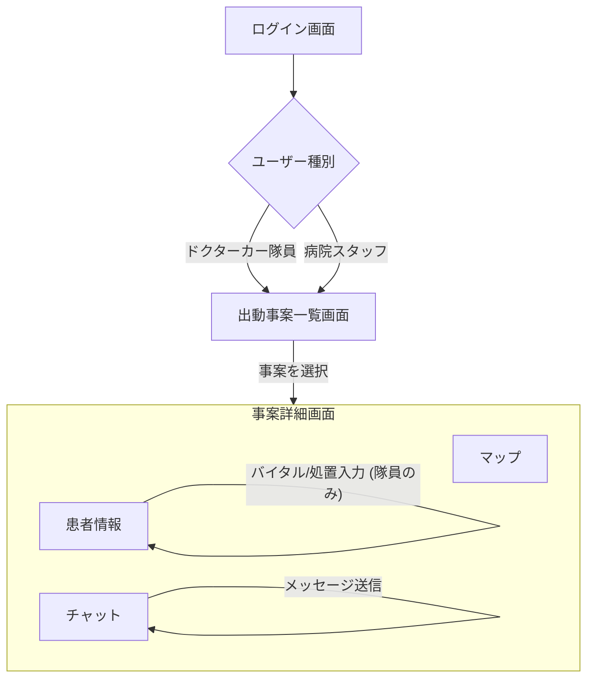

承知いたしました。「ドクターカーを安全かつ効率よく運用するためのオールインワン・アプリケーション」の概念実証（PoC: Proof of Concept）を目的としたデモアプリ開発のための、**要件定義・概要設計・詳細設計**を提案します。

デモアプリの目的は**「提案するコンセプトの価値を、関係者に直感的に体験してもらうこと」**です。そのため、全機能の実装ではなく、最も重要なコア機能に絞って開発を進めることを前提とします。

---

### 1. 要件定義 (何を開発するか)

#### 1.1. 目的とスコープ
*   **目的:** エントリーシートで示した課題解決のプロセスと提供価値（リアルタイム情報共有、業務効率化）を視覚的にデモンストレーションする。
*   **スコープ（対象範囲）:**
    *   **対象ユーザー:**
        1.  **ドクターカー隊員（医師/看護師）:** 現場で情報を入力・確認する役割。
        2.  **病院スタッフ（受け入れ担当）:** 院内で情報を受信・確認する役割。
    *   **対象機能:** アプリのコアバリューである「リアルタイム情報共有」と「活動の可視化」に特化する。AIによる意思決定支援などは、デモでは「将来的な機能」としてUI上に表示するのみとする。

#### 1.2. 機能要件 (アプリでできること)

| No. | 機能名 | 機能概要 | デモでの価値 |
| :-- | :--- | :--- | :--- |
| 1 | **出動事案管理** | 新規出動要請を受け、進行中の事案を一覧で確認できる。事案を選択すると詳細画面に遷移する。 | 業務の起点を示し、全体の流れを把握できる。 |
| 2 | **リアルタイム患者情報入力** | （ドクターカー隊員向け）傷病者のバイタルサイン（心拍数、血圧など）、処置内容、申し送り事項を時系列で簡単に入力・記録できる。 | 現場の活動を構造化し、情報共有の元データを作成するプロセスを見せる。 |
| 3 | **リアルタイム情報共有ダッシュボード** | （病院スタッフ向け）ドクターカー側で入力された患者情報が、ほぼリアルタイムでダッシュボードに表示される。 | **本アプリの最大の価値。**現場と病院の「情報格差」が解消される様子を体験させる。 |
| 4 | **GPSマップ連携** | ドクターカーの現在位置、現場、搬送先病院を地図上に表示する。 | 状況の視覚的な把握と、安全管理・到着時間予測の有用性を示す。 |
| 5 | **簡易コミュニケーション** | 事案ごとに設定されたチャットルームで、定型文やテキストメッセージを送受信できる。 | 煩雑な電話連絡を代替し、確実なコミュニケーションを実現する価値を示す。 |
| 6 | **活動記録の自動保存** | 入力された全ての情報（バイタル、処置、位置情報、チャット）は事案に紐づけて自動で保存される。 | 将来的なデータベース構築とメディカルコントロールへのフィードバックに繋がることを示唆する。 |

#### 1.3. 非機能要件 (どうあるべきか)
*   **ユーザビリティ:** 救急現場のストレス下でも直感的に操作できる、シンプルで分かりやすいUI/UX。
*   **パフォーマンス:** リアルタイム性を体感できるよう、データ更新や画面遷移が高速であること（デモなので疑似的でも可）。
*   **プラットフォーム:** iOS/Android両方で動作するクロスプラットフォーム（React Native, Flutter等）か、PWA（Progressive Web App）としてWebブラウザで動作させることを推奨（開発速度を優先）。
*   **データ:** デモ用のダミーデータを使用する。実際の患者情報は扱わない。

---

### 2. 概要設計 (どうやって実現するか - 全体像)

#### 2.1. システム構成図
BaaS (Backend as a Service) である **Firebase** の利用を推奨します。認証、リアルタイムデータベース、ストレージ機能が揃っており、迅速なデモ開発に最適です。

```mermaid
graph TD
    subgraph "ユーザーデバイス"
        U1[ドクターカー隊員 (スマホ/タブレット)]
        U2[病院スタッフ (PC/タブレット)]
    end

    subgraph "Firebase (Backend as a Service)"
        F_Auth[Firebase Authentication<br>(認証)]
        F_DB[Cloud Firestore<br>(リアルタイムDB)]
        F_Storage[Cloud Storage<br>(画像/動画保存)]
        F_Func[Cloud Functions<br>(サーバーレス処理)]
    end

    U1 -- ログイン/認証 --> F_Auth
    U2 -- ログイン/認証 --> F_Auth

    U1 -- "患者情報入力, GPS送信, チャット" --> F_DB
    U1 -- 写真/動画アップロード --> F_Storage

    F_DB -- リアルタイム更新 --> U1
    F_DB -- リアルタイム更新 --> U2

    U2 -- "受け入れ可否, チャット" --> F_DB
    
    F_Func -- "プッシュ通知送信など" --> U1 & U2
```

#### 2.2. アーキテクチャ
*   **クライアント:** React Native / Flutter (モバイルアプリ) or React / Vue.js (Webアプリ)でUIを構築。
*   **バックエンド:** Firebaseが担う。自前でサーバーを構築する必要がないため、開発リソースをフロントエンドに集中できる。
*   **データベース:** NoSQLデータベースである **Cloud Firestore** を採用。ドキュメント指向で柔軟なデータ構造を扱え、リアルタイム同期機能に優れる。
*   **リアルタイム技術:** Cloud Firestoreのリアルタイムリスナー機能を利用。データベースの特定のドキュメントが変更されると、それを購読している全てのクライアントに自動で変更がプッシュ通知される。

---

### 3. 詳細設計 (どうやって実現するか - 具体的な中身)

#### 3.1. 画面フロー図



#### 3.2. データベース設計 (Cloud Firestore)
コレクション（テーブルに相当）とドキュメント（レコードに相当）でデータを構成します。

*   **`cases` (コレクション)**: 全ての出動事案を管理
    *   **ドキュメントID**: `case_001`, `case_002`, ...
        *   `status`: "dispatched", "on_scene", "transporting", "completed" (文字列)
        *   `patientInfo`: { age: 45, gender: "male", ... } (オブジェクト)
        *   `createdAt`: タイムスタンプ
        *   `location`: { scene: GeoPoint, hospital: GeoPoint } (地理情報)
*   **`vitals` (サブコレクション)**: `cases` の各ドキュメントに紐づく
    *   **ドキュメントID**: 自動生成
        *   `timestamp`: タイムスタンプ
        *   `hr`: 90 (心拍数)
        *   `bp_s`: 120 (収縮期血圧)
        *   `bp_d`: 80 (拡張期血圧)
        *   `spo2`: 98 (酸素飽和度)
        *   `recordedBy`: "user_id_doctor_A" (記録者ID)
*   **`treatments` (サブコレクション)**: `cases` の各ドキュメントに紐づく
    *   **ドキュメントID**: 自動生成
        *   `timestamp`: タイムスタンプ
        *   `name`: "輸液ルート確保" (文字列)
        *   `details`: "右手に20G" (文字列)
*   **`locations` (サブコレクション)**: `cases` の各ドキュメントに紐づく
    *   **ドキュメントID**: 自動生成
        *   `timestamp`: タイムスタンプ
        *   `geoPoint`: GeoPoint (緯度経度)
        *   `userId`: "user_id_doctor_A"
*   **`messages` (サブコレクション)**: `cases` の各ドキュメントに紐づく
    *   **ドキュメントID**: 自動生成
        *   `timestamp`: タイムスタンプ
        *   `text`: "頭部外傷あり、CT準備お願いします"
        *   `senderId`: "user_id_doctor_A"

#### 3.3. API設計
Firebase SDKを利用するため、REST APIを直接設計・実装する必要はほとんどありません。SDKが提供するメソッドを呼び出す形になります。

*   **例：新規バイタル記録の追加** (JavaScript SDKの場合)
    ```javascript
    import { collection, addDoc, serverTimestamp } from "firebase/firestore"; 

    // 'case_001'のvitalsサブコレクションにドキュメントを追加
    await addDoc(collection(db, "cases", "case_001", "vitals"), {
      hr: 90,
      spo2: 98,
      timestamp: serverTimestamp() // サーバー側で時刻を記録
    });
    ```
*   **例：バイタル情報のリアルタイム購読**
    ```javascript
    import { collection, query, orderBy, onSnapshot } from "firebase/firestore";

    // 'case_001'のvitalsを時系列で購読し、変更があるたびにvitalsListを更新
    const q = query(collection(db, "cases", "case_001", "vitals"), orderBy("timestamp"));
    const unsubscribe = onSnapshot(q, (querySnapshot) => {
      const vitalsList = [];
      querySnapshot.forEach((doc) => {
          vitalsList.push(doc.data());
      });
      // ここでUIを更新する処理を呼び出す
      updateVitalsChart(vitalsList); 
    });
    ```

### 4. デモのシナリオ案
前回の回答で提案したシナリオを、この設計に基づいて実行します。
1.  **準備:** 2つの画面（ブラウザウィンドウやデバイス）を用意し、片方は「ドクターカー隊員」、もう片方は「病院スタッフ」としてログインしておく。
2.  **デモ開始:**
    *   **隊員側:** 「新規出動」事案を選択。マップ画面で現場へのルートを確認。
    *   **病院側:** ダッシュボードに「（隊員名）チームが出動中」と表示されるのを見せる。
3.  **情報入力と共有:**
    *   **隊員側:** 患者情報タブに移動し、バイタル（心拍数、血圧など）を数回入力する。
    *   **病院側:** 隊員が入力した瞬間に、自画面のバイタルグラフがリアルタイムで描画されていく様子を見せる。**（ここがハイライト）**
    *   **隊員側:** チャットで「意識レベル低下。受け入れ要請」と送信。
    *   **病院側:** チャット通知が表示され、「受け入れ可。脳外科医待機」と返信する。
4.  **完了:**
    *   **隊員側:** 搬送先を病院に設定し、「搬送開始」ボタンを押す。
    *   **病院側:** ステータスが「搬送中」に変わり、ドクターカーの現在位置がマップ上で病院に向かってくるのを見せる。
5.  **締め:** この一連の流れにより、いかに迅速で正確な情報共有が可能になり、病院側の準備体制構築や救命率向上に貢献できるかを説明して締めくくります。

この設計に基づけば、コアな価値を伝えるための効果的なデモアプリを効率的に開発できるはずです。