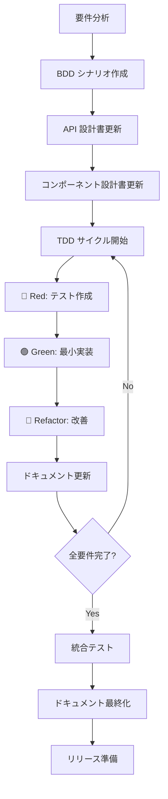
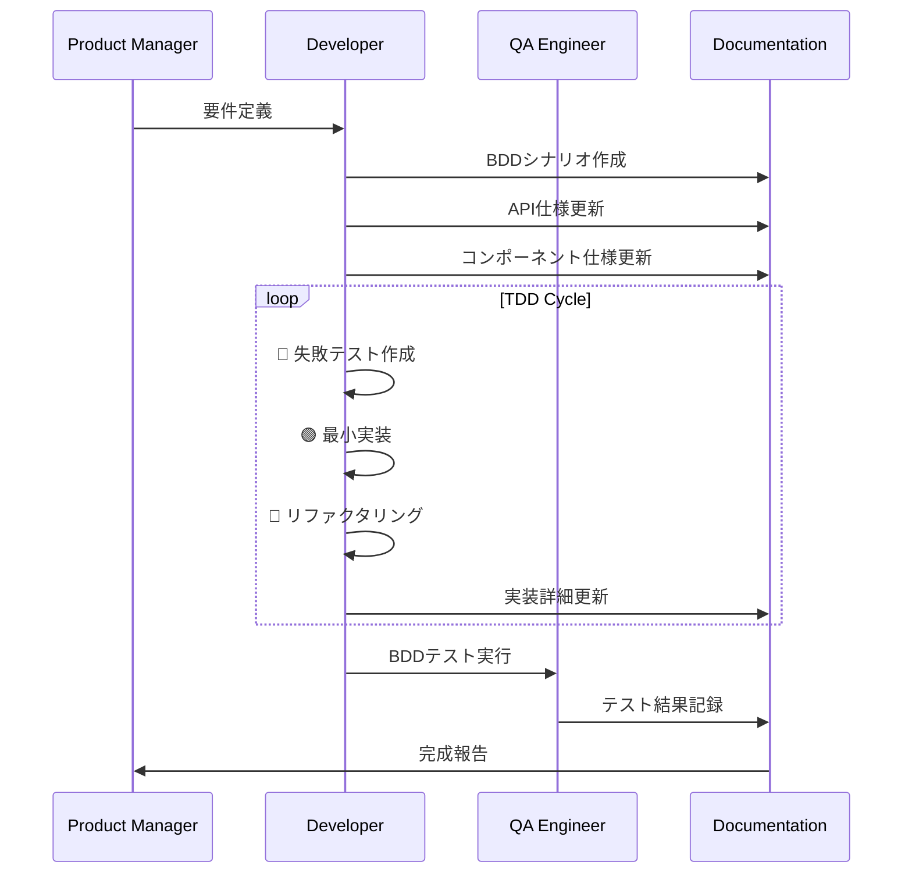

# TDD+DDD開発ワークフロー仕様書
## ドクターカー・オールインワンアプリケーション

### 1. 概要

本ドキュメントは、テスト駆動開発（TDD）とドキュメント駆動開発（DDD）を統合した開発ワークフローの詳細な実践指針を提供します。設計書からコード、テストまでの一貫した品質を保ちながら、効率的な開発プロセスを実現するための具体的な手順を定義します。

### 2. TDD+DDDワークフローアーキテクチャ

#### 2.1. 統合開発サイクル



#### 2.2. ドキュメント-コード同期原則

| 原則 | 説明 | 実践方法 |
|------|------|----------|
| **Single Source of Truth** | 一つの情報源 | API仕様書がコードの正とする |
| **Living Documentation** | 生きたドキュメント | コード変更時に自動更新 |
| **Executable Specification** | 実行可能仕様 | BDDシナリオからテスト自動生成 |
| **Continuous Validation** | 継続的検証 | ドキュメント-コード整合性チェック |

### 3. 機能開発ワークフロー

#### 3.1. 新機能開発プロセス



#### 3.2. 段階別詳細手順

##### Phase 1: 要件分析・設計 (1-2時間)

**Step 1: 要件の明確化**
```markdown
## 要件分析チェックリスト

### 機能要件
- [ ] ユーザーストーリーが明確である
- [ ] 受け入れ条件が定義されている
- [ ] 優先度が設定されている

### 技術要件
- [ ] 既存アーキテクチャとの整合性
- [ ] パフォーマンス要件
- [ ] セキュリティ要件

### ドキュメント更新
- [ ] 要件定義書への追記
- [ ] 影響するコンポーネントの特定
```

**Step 2: BDDシナリオ作成**
```gherkin
# 例: バイタルサイン入力機能
Feature: バイタルサイン入力機能の追加
  As a ドクターカー隊員
  I want to 患者のバイタルサインを迅速に入力する
  So that 病院が適切な受け入れ準備を行える

  Background:
    Given ドクターカー隊員として認証済み
    And 事案詳細画面を表示している

  Scenario: 正常なバイタルサイン入力
    Given バイタル入力フォームが表示されている
    When 有効なバイタルデータを入力する
    Then データが正常に保存される
    And タイムラインに新しい記録が表示される
```

**Step 3: 設計書更新**
```typescript
// API仕様書更新例
/**
 * バイタルサイン追加API
 * @param caseId - 事案ID
 * @param vital - バイタルデータ
 * @returns Promise<string> - 作成されたドキュメントID
 */
export const addVitalSign = async (
  caseId: string,
  vital: Omit<VitalSign, 'id' | 'timestamp' | 'caseId'>
): Promise<string> => {
  // 実装は後のTDDサイクルで行う
};
```

##### Phase 2: TDD実装サイクル (2-4時間)

**TDD Cycle 1: インターフェース定義**

```typescript
// 🔴 Red: インターフェーステスト
describe('VitalSign API Interface', () => {
  test('addVitalSign関数が定義されていること', () => {
    expect(typeof addVitalSign).toBe('function');
  });
  
  test('正しい型シグネチャを持つこと', () => {
    // TypeScriptコンパイルチェック
    const mockVital: Omit<VitalSign, 'id' | 'timestamp' | 'caseId'> = {
      hr: 90,
      bp_s: 120,
      bp_d: 80,
      spo2: 98,
      recordedBy: 'Test User'
    };
    
    // この時点では関数が存在しないのでテストは失敗
    expect(() => {
      addVitalSign('test-case', mockVital);
    }).not.toThrow();
  });
});
```

```typescript
// 🟢 Green: 最小実装
export const addVitalSign = async (
  caseId: string,
  vital: Omit<VitalSign, 'id' | 'timestamp' | 'caseId'>
): Promise<string> => {
  // 最小限の実装（とりあえずテストが通るようにする）
  return 'mock-vital-id';
};
```

```typescript
// 🔵 Refactor: 型定義の改善
interface VitalSignInput {
  hr: number;
  bp_s: number;
  bp_d: number;
  spo2: number;
  recordedBy: string;
}

export const addVitalSign = async (
  caseId: string,
  vital: VitalSignInput
): Promise<string> => {
  // より型安全な実装
  return 'mock-vital-id';
};
```

**TDD Cycle 2: データ検証**

```typescript
// 🔴 Red: バリデーションテスト
describe('VitalSign Validation', () => {
  test('有効なバイタルデータで成功すること', async () => {
    const validVital = {
      hr: 90,
      bp_s: 120,
      bp_d: 80,
      spo2: 98,
      recordedBy: 'Test User'
    };
    
    const result = await addVitalSign('test-case', validVital);
    expect(result).toBeTruthy();
  });
  
  test('無効な心拍数でエラーになること', async () => {
    const invalidVital = {
      hr: 300, // 範囲外
      bp_s: 120,
      bp_d: 80,
      spo2: 98,
      recordedBy: 'Test User'
    };
    
    await expect(addVitalSign('test-case', invalidVital))
      .rejects.toThrow('心拍数は40-200の範囲で入力してください');
  });
});
```

```typescript
// 🟢 Green: バリデーション実装
import { VITAL_RANGES } from '../constants';

export const addVitalSign = async (
  caseId: string,
  vital: VitalSignInput
): Promise<string> => {
  // バリデーション
  if (vital.hr < VITAL_RANGES.HR.min || vital.hr > VITAL_RANGES.HR.max) {
    throw new Error('心拍数は40-200の範囲で入力してください');
  }
  
  // 他のバリデーション...
  
  return 'mock-vital-id';
};
```

**TDD Cycle 3: Firebase統合**

```typescript
// 🔴 Red: Firebase統合テスト
describe('VitalSign Firebase Integration', () => {
  test('Firestoreにデータが保存されること', async () => {
    const mockAddDoc = jest.fn().mockResolvedValue({ id: 'test-vital-id' });
    jest.mock('firebase/firestore', () => ({
      addDoc: mockAddDoc,
      collection: jest.fn(),
      Timestamp: { now: jest.fn(() => ({ toDate: () => new Date() })) }
    }));
    
    const vital = {
      hr: 90,
      bp_s: 120,
      bp_d: 80,
      spo2: 98,
      recordedBy: 'Test User'
    };
    
    const result = await addVitalSign('test-case', vital);
    
    expect(mockAddDoc).toHaveBeenCalled();
    expect(result).toBe('test-vital-id');
  });
});
```

```typescript
// 🟢 Green: Firebase実装
import { addDoc, collection, Timestamp } from 'firebase/firestore';
import { db } from '../config/firebase';

export const addVitalSign = async (
  caseId: string,
  vital: VitalSignInput
): Promise<string> => {
  // バリデーション（既存）
  validateVitalSign(vital);
  
  // Firestore保存
  const vitalsRef = collection(db, 'cases', caseId, 'vitals');
  const docRef = await addDoc(vitalsRef, {
    ...vital,
    timestamp: Timestamp.now(),
    caseId
  });
  
  return docRef.id;
};
```

##### Phase 3: ドキュメント同期 (30分)

**Step 1: API仕様書更新**
```typescript
// src/services/vitalsService.ts の最終実装をもとに更新
/**
 * バイタルサイン追加
 * @param caseId - 事案ID  
 * @param vital - バイタルデータ
 * @returns Promise<string> - 作成されたドキュメントID
 * @throws {AppError} バリデーションエラー時
 * 
 * @example
 * ```typescript
 * const vitalId = await addVitalSign('case-001', {
 *   hr: 90,
 *   bp_s: 120, 
 *   bp_d: 80,
 *   spo2: 98,
 *   recordedBy: '山田 太郎'
 * });
 * ```
 */
```

**Step 2: コンポーネント仕様更新**
```typescript
// コンポーネント設計書に追加
/**
 * VitalSignForm - バイタルサイン入力フォーム
 * 
 * 新機能:
 * - リアルタイムバリデーション
 * - 異常値警告表示
 * - 自動保存機能
 */
```

**Step 3: テスト仕様更新**
```typescript
// test-specification.md に追加
/**
 * バイタルサイン入力機能テスト
 * 
 * 追加されたテストケース:
 * - 正常値入力テスト
 * - 異常値バリデーションテスト  
 * - Firebase統合テスト
 * - UIコンポーネントテスト
 */
```

### 4. コード品質管理

#### 4.1. 品質ゲート

```yaml
# .github/workflows/quality-gates.yml
name: Quality Gates

on:
  pull_request:
    branches: [main]

jobs:
  documentation-sync:
    runs-on: ubuntu-latest
    steps:
      - name: Check API Documentation Sync
        run: npm run docs:validate
        
      - name: Validate BDD Scenarios
        run: npm run test:bdd:validate
        
      - name: Check Code Coverage
        run: npm run test:coverage -- --threshold=90

  tdd-compliance:
    runs-on: ubuntu-latest  
    steps:
      - name: Verify Test-First Development
        run: npm run tdd:verify
        
      - name: Check Test Quality
        run: npm run test:quality-check
```

#### 4.2. 自動品質チェック

```typescript
// scripts/quality-check.ts
export class QualityChecker {
  static async validateDocumentationSync() {
    // API仕様書とコードの整合性チェック
    const apiSpecs = await this.parseApiSpecs();
    const codeImplementations = await this.parseCodeImplementations();
    
    const mismatches = [];
    
    for (const spec of apiSpecs) {
      const implementation = codeImplementations.find(impl => 
        impl.name === spec.name
      );
      
      if (!implementation) {
        mismatches.push(`Missing implementation: ${spec.name}`);
      } else if (!this.signatureMatches(spec, implementation)) {
        mismatches.push(`Signature mismatch: ${spec.name}`);
      }
    }
    
    if (mismatches.length > 0) {
      throw new Error(`Documentation sync issues:\n${mismatches.join('\n')}`);
    }
  }
  
  static async validateBDDCoverage() {
    // BDDシナリオとテストの対応チェック
    const scenarios = await this.parseBDDScenarios();
    const testImplementations = await this.parseTestImplementations();
    
    const uncoveredScenarios = scenarios.filter(scenario =>
      !testImplementations.some(test => 
        test.description.includes(scenario.title)
      )
    );
    
    if (uncoveredScenarios.length > 0) {
      throw new Error(`Uncovered BDD scenarios: ${uncoveredScenarios.map(s => s.title).join(', ')}`);
    }
  }
}
```

### 5. 開発環境統合

#### 5.1. VS Code ワークスペース設定

```json
// .vscode/settings.json
{
  "files.associations": {
    "*.feature": "gherkin"
  },
  
  "emmet.includeLanguages": {
    "typescript": "html"
  },
  
  "typescript.preferences.includePackageJsonAutoImports": "auto",
  
  "jest.autoRun": {
    "watch": true,
    "onStartup": ["all-tests"]
  },
  
  "cucumberautocomplete.steps": [
    "src/test/step-definitions/**/*.ts"
  ],
  "cucumberautocomplete.syncfeatures": "src/test/features/**/*.feature",
  "cucumberautocomplete.strictGherkinCompletion": true,
  
  "markdownlint.config": {
    "MD013": false,
    "MD033": false
  }
}
```

```json
// .vscode/tasks.json
{
  "version": "2.0.0",
  "tasks": [
    {
      "label": "TDD Cycle Start",
      "type": "shell",
      "command": "npm run test:watch",
      "group": "test",
      "presentation": {
        "echo": true,
        "reveal": "always",
        "focus": false,
        "panel": "shared"
      }
    },
    {
      "label": "BDD Test Run",
      "type": "shell", 
      "command": "npm run test:bdd",
      "group": "test"
    },
    {
      "label": "Documentation Update",
      "type": "shell",
      "command": "npm run docs:generate",
      "group": "build"
    }
  ]
}
```

#### 5.2. Package.json スクリプト

```json
{
  "scripts": {
    "dev": "vite",
    "build": "tsc && vite build",
    
    "test": "jest",
    "test:watch": "jest --watch --verbose",
    "test:coverage": "jest --coverage",
    "test:tdd": "jest --watch --testNamePattern='TDD'",
    
    "test:bdd": "cucumber-js",
    "test:bdd:watch": "cucumber-js --watch",
    "test:bdd:validate": "cucumber-js --dry-run",
    
    "docs:generate": "node scripts/generate-docs.js",
    "docs:validate": "node scripts/validate-docs.js",
    "docs:serve": "docsify serve docs",
    
    "tdd:verify": "node scripts/verify-tdd-compliance.js",
    "quality:check": "node scripts/quality-check.js",
    
    "workflow:feature": "node scripts/start-feature-workflow.js",
    "workflow:complete": "node scripts/complete-feature-workflow.js"
  }
}
```

### 6. ワークフロー自動化

#### 6.1. 機能開発開始スクリプト

```typescript
// scripts/start-feature-workflow.js
import inquirer from 'inquirer';
import fs from 'fs/promises';

async function startFeatureWorkflow() {
  const answers = await inquirer.prompt([
    {
      type: 'input',
      name: 'featureName',
      message: '機能名を入力してください:'
    },
    {
      type: 'input', 
      name: 'userStory',
      message: 'ユーザーストーリーを入力してください:'
    },
    {
      type: 'list',
      name: 'priority',
      message: '優先度を選択してください:',
      choices: ['high', 'medium', 'low']
    }
  ]);
  
  // BDDファイルテンプレート生成
  const featureTemplate = `
Feature: ${answers.featureName}
  ${answers.userStory}

  Background:
    Given [前提条件を記述]

  Scenario: [シナリオ名]
    Given [前提条件]
    When [アクション]
    Then [期待結果]
  `;
  
  await fs.writeFile(
    `src/test/features/${answers.featureName.toLowerCase().replace(/\s+/g, '-')}.feature`,
    featureTemplate
  );
  
  // TDDテストファイルテンプレート生成
  const testTemplate = `
describe('${answers.featureName} - TDD Development', () => {
  beforeEach(() => {
    // セットアップ
  });

  describe('Phase 1: Interface Definition', () => {
    test('should define required interfaces', () => {
      // インターフェース定義テスト
    });
  });

  describe('Phase 2: Implementation', () => {
    test('should implement core functionality', () => {
      // 実装テスト
    });
  });

  describe('Phase 3: Integration', () => {
    test('should integrate with existing system', () => {
      // 統合テスト
    });
  });
});
  `;
  
  await fs.writeFile(
    `src/test/${answers.featureName.toLowerCase().replace(/\s+/g, '-')}.test.ts`,
    testTemplate
  );
  
  console.log(`✅ ${answers.featureName} の開発環境が準備されました`);
  console.log('📝 次のステップ:');
  console.log('1. BDDシナリオを詳細化してください');
  console.log('2. API仕様書を更新してください');
  console.log('3. TDDサイクルを開始してください');
}

startFeatureWorkflow().catch(console.error);
```

#### 6.2. ワークフロー完了チェック

```typescript
// scripts/complete-feature-workflow.js
export class FeatureCompletionChecker {
  static async checkCompletion(featureName: string) {
    const checks = [
      await this.checkBDDScenarios(featureName),
      await this.checkTDDTests(featureName), 
      await this.checkDocumentationUpdates(featureName),
      await this.checkCodeCoverage(featureName),
      await this.checkIntegrationTests(featureName)
    ];
    
    const passed = checks.filter(check => check.passed).length;
    const total = checks.length;
    
    console.log(`✅ 完了チェック: ${passed}/${total}`);
    
    if (passed === total) {
      console.log('🎉 機能開発が完了しました！');
      return true;
    } else {
      console.log('❌ 以下の項目が未完了です:');
      checks.filter(check => !check.passed).forEach(check => {
        console.log(`- ${check.name}: ${check.reason}`);
      });
      return false;
    }
  }
  
  private static async checkBDDScenarios(featureName: string) {
    // BDDシナリオの実装チェック
    const featureFile = `src/test/features/${featureName.toLowerCase().replace(/\s+/g, '-')}.feature`;
    const stepDefinitions = await this.findStepDefinitions(featureFile);
    
    return {
      name: 'BDD Scenarios',
      passed: stepDefinitions.length > 0,
      reason: stepDefinitions.length === 0 ? 'ステップ定義が実装されていません' : ''
    };
  }
}
```

### 7. 継続的改善

#### 7.1. メトリクス収集

```typescript
// scripts/collect-workflow-metrics.ts
export class WorkflowMetrics {
  static async collectDailyMetrics() {
    const metrics = {
      tddCycles: await this.countTDDCycles(),
      documentationUpdates: await this.countDocumentationUpdates(),
      bddScenariosCovered: await this.calculateBDDCoverage(),
      codeQualityScore: await this.calculateQualityScore(),
      developmentVelocity: await this.calculateVelocity()
    };
    
    await this.saveMetrics(metrics);
    await this.generateDashboard(metrics);
  }
  
  private static async countTDDCycles() {
    // Git コミット履歴から Red-Green-Refactor パターンを検出
    const commits = await this.getGitCommits();
    const tddPattern = /^(🔴|🟢|🔵)/;
    
    return commits.filter(commit => 
      tddPattern.test(commit.message)
    ).length;
  }
  
  private static async calculateBDDCoverage() {
    const scenarios = await this.getAllBDDScenarios();
    const implementedScenarios = await this.getImplementedBDDScenarios();
    
    return (implementedScenarios.length / scenarios.length) * 100;
  }
}
```

#### 7.2. プロセス改善提案

```typescript
// scripts/process-improvement.ts
export class ProcessImprovement {
  static async analyzeDevelopmentPatterns() {
    const patterns = await this.identifyPatterns();
    const bottlenecks = await this.identifyBottlenecks();
    const improvements = await this.suggestImprovements(patterns, bottlenecks);
    
    return {
      patterns,
      bottlenecks,
      improvements
    };
  }
  
  private static async identifyBottlenecks() {
    return [
      {
        area: 'Documentation Sync',
        impact: 'medium',
        suggestion: 'API仕様書の自動生成を導入'
      },
      {
        area: 'Test Data Setup', 
        impact: 'high',
        suggestion: 'テストデータファクトリーの充実'
      }
    ];
  }
}
```

### 8. チーム協業指針

#### 8.1. レビュープロセス

```markdown
## Pull Request チェックリスト

### TDD Compliance
- [ ] Red-Green-Refactor サイクルが守られている
- [ ] テストがコードより先にコミットされている
- [ ] 適切なリファクタリングが行われている

### BDD Compliance  
- [ ] 新機能に対応するBDDシナリオが作成されている
- [ ] シナリオが実装されている
- [ ] 受け入れテストが通過している

### Documentation Sync
- [ ] API仕様書が更新されている
- [ ] コンポーネント設計書が更新されている
- [ ] 実装ガイドが更新されている（必要に応じて）

### Code Quality
- [ ] カバレッジが90%以上
- [ ] ESLintエラーなし
- [ ] TypeScriptエラーなし
- [ ] 新規技術債務の発生なし
```

#### 8.2. ペアプログラミング指針

```markdown
## TDD+DDD ペアプログラミング

### 役割分担
- **Navigator**: 設計・テスト戦略・ドキュメント更新
- **Driver**: コード実装・テスト実装

### 30分ローテーション
1. **0-10分**: 要件確認・BDDシナリオレビュー
2. **10-20分**: TDD Red-Green サイクル
3. **20-30分**: Refactor・ドキュメント更新

### 品質チェックポイント
- TDDサイクルの適切な実行
- ドキュメントとコードの整合性
- BDDシナリオの網羅性
```

このTDD+DDD統合ワークフローにより、高品質なコードと正確なドキュメントを同時に維持しながら、効率的な開発プロセスを実現できます。