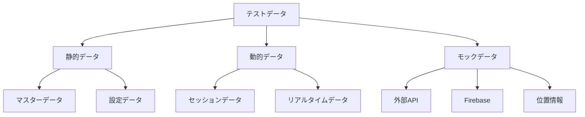

# テストデータ・モック仕様書
## ドクターカー・オールインワンアプリケーション

### 1. 概要

本ドキュメントは、TDD+BDD開発において使用するテストデータとモックの詳細仕様を定義します。Firebase エミュレーター、MSW（Mock Service Worker）、テスト用ダミーデータの設定と管理方法を包括的に説明します。

### 2. テストデータ戦略

#### 2.1. テストデータ分類



#### 2.2. データ品質原則

| 原則 | 説明 | 実装 |
|------|------|------|
| **Deterministic** | 実行毎に同じ結果 | シード値固定 |
| **Isolated** | テスト間で独立 | データクリーンアップ |
| **Realistic** | 本番に近いデータ | 実際のユースケース反映 |
| **Minimal** | 必要最小限 | テスト目的に特化 |

### 3. Firebase エミュレーター設定

#### 3.1. エミュレーター構成

**`firebase.json`**
```json
{
  "emulators": {
    "auth": {
      "port": 9099,
      "host": "localhost"
    },
    "firestore": {
      "port": 8080,
      "host": "localhost"
    },
    "functions": {
      "port": 5001,
      "host": "localhost"
    },
    "hosting": {
      "port": 5000,
      "host": "localhost"
    },
    "ui": {
      "enabled": true,
      "port": 4000,
      "host": "localhost"
    },
    "singleProjectMode": true
  }
}
```

#### 3.2. Firestore セキュリティルール（テスト用）

**`firestore.rules`**
```javascript
rules_version = '2';
service cloud.firestore {
  match /databases/{database}/documents {
    // テスト環境では全アクセス許可
    match /{document=**} {
      allow read, write: if request.auth != null || 
        resource.data.allowTestAccess == true;
    }
    
    // 本番環境用のルール（エミュレーターでは無効）
    match /users/{userId} {
      allow read, write: if request.auth != null && request.auth.uid == userId;
    }
    
    match /cases/{caseId} {
      allow read: if request.auth != null;
      allow write: if request.auth != null && 
        request.auth.token.role in ['doctor_car', 'hospital'];
    }
  }
}
```

#### 3.3. Authentication エミュレーター設定

```typescript
// src/test/setup/firebase-emulator.ts
import { connectAuthEmulator, getAuth } from 'firebase/auth';
import { connectFirestoreEmulator, getFirestore } from 'firebase/firestore';
import { initializeApp, getApps } from 'firebase/app';

const firebaseConfig = {
  projectId: 'demo-doctorcar',
  apiKey: 'demo-key',
  authDomain: 'demo-doctorcar.firebaseapp.com',
};

let app;
if (getApps().length === 0) {
  app = initializeApp(firebaseConfig);
} else {
  app = getApps()[0];
}

export const auth = getAuth(app);
export const db = getFirestore(app);

// エミュレーター接続
if (process.env.NODE_ENV === 'test') {
  connectAuthEmulator(auth, 'http://localhost:9099');
  connectFirestoreEmulator(db, 'localhost', 8080);
}
```

### 4. テストデータセット

#### 4.1. ユーザーデータ

```typescript
// src/test/data/users.ts
export const TEST_USERS = {
  DOCTOR_CAR_MEMBER: {
    uid: 'doctor-001',
    email: 'doctor@test.com',
    password: 'testpass123',
    userInfo: {
      uid: 'doctor-001',
      name: '山田 太郎',
      role: 'doctor_car' as const,
      team: '東京科学大学病院ドクターカー',
      email: 'doctor@test.com'
    }
  },
  
  HOSPITAL_STAFF: {
    uid: 'hospital-001',
    email: 'hospital@test.com', 
    password: 'testpass123',
    userInfo: {
      uid: 'hospital-001',
      name: '佐藤 花子',
      role: 'hospital' as const,
      team: '東京科学大学病院',
      email: 'hospital@test.com'
    }
  },
  
  ADMIN_USER: {
    uid: 'admin-001',
    email: 'admin@test.com',
    password: 'testpass123',
    userInfo: {
      uid: 'admin-001',
      name: '管理者',
      role: 'hospital' as const,
      team: 'システム管理',
      email: 'admin@test.com'
    }
  }
} as const;

// パスワードハッシュ化ユーティリティ
export const createTestUser = async (userKey: keyof typeof TEST_USERS) => {
  const user = TEST_USERS[userKey];
  
  // エミュレーター環境でのユーザー作成
  const userCredential = await createUserWithEmailAndPassword(
    auth, 
    user.email, 
    user.password
  );
  
  // Firestore にユーザー情報保存
  await setDoc(doc(db, 'users', userCredential.user.uid), user.userInfo);
  
  return userCredential.user;
};
```

#### 4.2. 事案データ

```typescript
// src/test/data/cases.ts
import { GeoPoint, Timestamp } from 'firebase/firestore';

export const TEST_CASES = {
  ACTIVE_CASE: {
    id: 'case-001',
    caseName: '2024-01-15 渋谷駅前 交通外傷',
    status: 'on_scene' as const,
    teamId: 'doctor-001',
    patientInfo: {
      age: 45,
      gender: 'male' as const,
      name: '田中 一郎'
    },
    sceneLocation: new GeoPoint(35.658584, 139.701442), // 渋谷駅
    hospitalLocation: new GeoPoint(35.665498, 139.686567), // 東京大学病院
    createdAt: Timestamp.fromDate(new Date('2024-01-15T10:00:00Z')),
    updatedAt: Timestamp.fromDate(new Date('2024-01-15T10:30:00Z'))
  },
  
  COMPLETED_CASE: {
    id: 'case-002',
    caseName: '2024-01-14 新宿区内 心肺停止',
    status: 'completed' as const,
    teamId: 'doctor-001',
    patientInfo: {
      age: 67,
      gender: 'female' as const,
      name: '鈴木 恵子'
    },
    sceneLocation: new GeoPoint(35.689487, 139.691706), // 新宿駅
    hospitalLocation: new GeoPoint(35.665498, 139.686567),
    createdAt: Timestamp.fromDate(new Date('2024-01-14T14:00:00Z')),
    updatedAt: Timestamp.fromDate(new Date('2024-01-14T16:45:00Z'))
  },
  
  DISPATCHED_CASE: {
    id: 'case-003',
    caseName: '2024-01-15 品川区 意識不明',
    status: 'dispatched' as const,
    teamId: 'doctor-001',
    patientInfo: {
      age: 28,
      gender: 'male' as const
    },
    sceneLocation: new GeoPoint(35.627701, 139.740689), // 品川駅
    hospitalLocation: new GeoPoint(35.665498, 139.686567),
    createdAt: Timestamp.fromDate(new Date('2024-01-15T11:00:00Z')),
    updatedAt: Timestamp.fromDate(new Date('2024-01-15T11:00:00Z'))
  }
} as const;

export const createTestCase = async (caseKey: keyof typeof TEST_CASES) => {
  const caseData = TEST_CASES[caseKey];
  await setDoc(doc(db, 'cases', caseData.id), caseData);
  return caseData;
};
```

#### 4.3. バイタルサインデータ

```typescript
// src/test/data/vitals.ts
export const TEST_VITALS = {
  NORMAL_VITALS: [
    {
      id: 'vital-001',
      timestamp: Timestamp.fromDate(new Date('2024-01-15T10:05:00Z')),
      hr: 90,
      bp_s: 120,
      bp_d: 80,
      spo2: 98,
      recordedBy: '山田 太郎',
      caseId: 'case-001'
    },
    {
      id: 'vital-002', 
      timestamp: Timestamp.fromDate(new Date('2024-01-15T10:10:00Z')),
      hr: 95,
      bp_s: 125,
      bp_d: 85,
      spo2: 97,
      recordedBy: '山田 太郎',
      caseId: 'case-001'
    }
  ],
  
  CRITICAL_VITALS: [
    {
      id: 'vital-003',
      timestamp: Timestamp.fromDate(new Date('2024-01-15T10:15:00Z')),
      hr: 180, // 異常値
      bp_s: 80,  // 低血圧
      bp_d: 50,
      spo2: 85,  // 低酸素
      recordedBy: '山田 太郎',
      caseId: 'case-001'
    }
  ],
  
  INVALID_VITALS: {
    hr: 300,    // 範囲外
    bp_s: 50,   // 範囲外
    bp_d: 200,  // 範囲外
    spo2: 150   // 範囲外
  }
} as const;

export const createTestVitals = async (
  caseId: string, 
  vitalsKey: keyof typeof TEST_VITALS
) => {
  const vitals = TEST_VITALS[vitalsKey];
  
  if (Array.isArray(vitals)) {
    for (const vital of vitals) {
      await addDoc(collection(db, 'cases', caseId, 'vitals'), {
        ...vital,
        caseId
      });
    }
  }
  
  return vitals;
};
```

#### 4.4. 処置データ

```typescript
// src/test/data/treatments.ts
export const TEST_TREATMENTS = {
  STANDARD_TREATMENTS: [
    {
      id: 'treatment-001',
      timestamp: Timestamp.fromDate(new Date('2024-01-15T10:07:00Z')),
      name: '静脈路確保',
      details: '右前腕に20G留置針で確保',
      recordedBy: '山田 太郎',
      caseId: 'case-001'
    },
    {
      id: 'treatment-002',
      timestamp: Timestamp.fromDate(new Date('2024-01-15T10:12:00Z')), 
      name: '酸素投与',
      details: 'リザーバーマスク 15L/min',
      recordedBy: '山田 太郎',
      caseId: 'case-001'
    }
  ],
  
  EMERGENCY_TREATMENTS: [
    {
      id: 'treatment-003',
      timestamp: Timestamp.fromDate(new Date('2024-01-15T10:18:00Z')),
      name: '心肺蘇生',
      details: '胸骨圧迫開始 AED準備',
      recordedBy: '山田 太郎',
      caseId: 'case-001'
    }
  ]
} as const;
```

#### 4.5. メッセージデータ

```typescript
// src/test/data/messages.ts
export const TEST_MESSAGES = {
  CONVERSATION_FLOW: [
    {
      id: 'msg-001',
      timestamp: Timestamp.fromDate(new Date('2024-01-15T10:05:00Z')),
      senderId: 'doctor-001',
      senderName: '山田 太郎',
      text: '現場到着しました。患者は意識清明です。',
      messageType: 'text' as const,
      caseId: 'case-001'
    },
    {
      id: 'msg-002',
      timestamp: Timestamp.fromDate(new Date('2024-01-15T10:06:00Z')),
      senderId: 'hospital-001',
      senderName: '佐藤 花子',
      text: '了解しました。受け入れ準備を開始します。',
      messageType: 'text' as const,
      caseId: 'case-001'
    },
    {
      id: 'msg-003',
      timestamp: Timestamp.fromDate(new Date('2024-01-15T10:20:00Z')),
      senderId: 'doctor-001',
      senderName: '山田 太郎',
      text: '患者搬送準備完了',
      messageType: 'preset' as const,
      caseId: 'case-001'
    }
  ],
  
  PRESET_MESSAGES: [
    {
      id: 'msg-preset-001',
      timestamp: Timestamp.now(),
      senderId: 'hospital-001',
      senderName: '佐藤 花子',
      text: '受け入れ準備完了',
      messageType: 'preset' as const,
      caseId: 'case-001'
    }
  ]
} as const;
```

#### 4.6. 位置情報データ

```typescript
// src/test/data/locations.ts
export const TEST_LOCATIONS = {
  ROUTE_TO_HOSPITAL: [
    {
      id: 'loc-001',
      timestamp: Timestamp.fromDate(new Date('2024-01-15T10:25:00Z')),
      geoPoint: new GeoPoint(35.658584, 139.701442), // 渋谷駅（出発点）
      userId: 'doctor-001',
      caseId: 'case-001',
      accuracy: 10
    },
    {
      id: 'loc-002',
      timestamp: Timestamp.fromDate(new Date('2024-01-15T10:30:00Z')),
      geoPoint: new GeoPoint(35.661777, 139.698334), // 中間点
      userId: 'doctor-001',
      caseId: 'case-001',
      accuracy: 8
    },
    {
      id: 'loc-003',
      timestamp: Timestamp.fromDate(new Date('2024-01-15T10:35:00Z')),
      geoPoint: new GeoPoint(35.665498, 139.686567), // 病院到着
      userId: 'doctor-001',
      caseId: 'case-001',
      accuracy: 5
    }
  ]
} as const;
```

### 5. モック設定

#### 5.1. MSW（Mock Service Worker）設定

```typescript
// src/test/mocks/handlers.ts
import { rest } from 'msw';
import { TEST_USERS, TEST_CASES } from '../data';

export const handlers = [
  // Firebase Authentication モック
  rest.post(
    'https://identitytoolkit.googleapis.com/v1/accounts:signInWithPassword', 
    (req, res, ctx) => {
      const { email, password } = req.body as any;
      
      const user = Object.values(TEST_USERS).find(u => 
        u.email === email && u.password === password
      );
      
      if (user) {
        return res(
          ctx.json({
            kind: 'identitytoolkit#VerifyPasswordResponse',
            localId: user.uid,
            email: user.email,
            displayName: user.userInfo.name,
            idToken: `mock-id-token-${user.uid}`,
            registered: true,
            refreshToken: `mock-refresh-token-${user.uid}`,
            expiresIn: '3600'
          })
        );
      }
      
      return res(
        ctx.status(400),
        ctx.json({
          error: {
            code: 400,
            message: 'INVALID_PASSWORD'
          }
        })
      );
    }
  ),
  
  // Geolocation API モック
  rest.get('/api/geolocation', (req, res, ctx) => {
    return res(
      ctx.json({
        coords: {
          latitude: 35.658584,
          longitude: 139.701442,
          accuracy: 10,
          altitude: null,
          altitudeAccuracy: null,
          heading: null,
          speed: null
        },
        timestamp: Date.now()
      })
    );
  }),
  
  // 外部API（OpenStreetMap タイルサービス等）のモック
  rest.get('https://*.tile.openstreetmap.org/*', (req, res, ctx) => {
    // タイル画像のモック（実際の実装では必要に応じて）
    return res(ctx.status(200));
  })
];
```

```typescript
// src/test/mocks/server.ts
import { setupServer } from 'msw/node';
import { handlers } from './handlers';

export const server = setupServer(...handlers);

// テストセットアップ
export const setupMockServer = () => {
  beforeAll(() => server.listen({ onUnhandledRequest: 'error' }));
  afterEach(() => server.resetHandlers());
  afterAll(() => server.close());
};
```

#### 5.2. Firebase モック

```typescript
// src/test/mocks/firebase.ts
export const mockFirebaseAuth = {
  currentUser: null,
  signInWithEmailAndPassword: jest.fn(),
  signOut: jest.fn(),
  onAuthStateChanged: jest.fn()
};

export const mockFirestore = {
  collection: jest.fn(() => ({
    add: jest.fn(),
    get: jest.fn(),
    where: jest.fn(() => ({
      get: jest.fn()
    })),
    orderBy: jest.fn(() => ({
      get: jest.fn()
    }))
  })),
  doc: jest.fn(() => ({
    get: jest.fn(),
    set: jest.fn(),
    update: jest.fn(),
    delete: jest.fn()
  })),
  onSnapshot: jest.fn()
};

// モック関数のリセット
export const resetFirebaseMocks = () => {
  Object.values(mockFirebaseAuth).forEach(mock => {
    if (jest.isMockFunction(mock)) {
      mock.mockReset();
    }
  });
  
  Object.values(mockFirestore).forEach(mock => {
    if (jest.isMockFunction(mock)) {
      mock.mockReset();
    }
  });
};
```

#### 5.3. 位置情報サービスモック

```typescript
// src/test/mocks/geolocation.ts
export class MockGeolocation {
  private static position = {
    coords: {
      latitude: 35.658584,
      longitude: 139.701442,
      accuracy: 10,
      altitude: null,
      altitudeAccuracy: null,
      heading: null,
      speed: null
    },
    timestamp: Date.now()
  };
  
  static setPosition(lat: number, lng: number, accuracy = 10) {
    this.position = {
      coords: {
        latitude: lat,
        longitude: lng,
        accuracy,
        altitude: null,
        altitudeAccuracy: null,
        heading: null,
        speed: null
      },
      timestamp: Date.now()
    };
  }
  
  static getCurrentPosition(success: PositionCallback, error?: PositionErrorCallback) {
    setTimeout(() => {
      success(this.position as GeolocationPosition);
    }, 100);
  }
  
  static watchPosition(success: PositionCallback, error?: PositionErrorCallback) {
    const watchId = setInterval(() => {
      success(this.position as GeolocationPosition);
    }, 1000);
    
    return watchId;
  }
  
  static clearWatch(watchId: number) {
    clearInterval(watchId);
  }
}

// グローバル設定
export const setupGeolocationMock = () => {
  Object.defineProperty(global.navigator, 'geolocation', {
    value: {
      getCurrentPosition: MockGeolocation.getCurrentPosition,
      watchPosition: MockGeolocation.watchPosition,
      clearWatch: MockGeolocation.clearWatch
    },
    writable: true
  });
};
```

### 6. テストデータファクトリー

#### 6.1. データ生成ファクトリー

```typescript
// src/test/factories/index.ts
import { faker } from '@faker-js/faker';
import { GeoPoint, Timestamp } from 'firebase/firestore';

export class TestDataFactory {
  static createUser(overrides: Partial<AppUser> = {}) {
    return {
      uid: faker.string.uuid(),
      name: faker.person.fullName(),
      role: faker.helpers.arrayElement(['doctor_car', 'hospital']),
      team: faker.company.name(),
      email: faker.internet.email(),
      ...overrides
    };
  }
  
  static createCase(overrides: Partial<Case> = {}) {
    const now = new Date();
    return {
      id: faker.string.uuid(),
      caseName: `${faker.date.recent().toISOString().split('T')[0]} ${faker.location.city()} ${faker.helpers.arrayElement(['交通外傷', '心肺停止', '意識不明'])}`,
      status: faker.helpers.arrayElement(['dispatched', 'on_scene', 'transporting', 'completed']),
      teamId: faker.string.uuid(),
      patientInfo: {
        age: faker.number.int({ min: 18, max: 90 }),
        gender: faker.helpers.arrayElement(['male', 'female', 'other']),
        name: faker.person.fullName()
      },
      sceneLocation: new GeoPoint(
        faker.location.latitude({ min: 35.6, max: 35.7 }),
        faker.location.longitude({ min: 139.6, max: 139.8 })
      ),
      hospitalLocation: new GeoPoint(35.665498, 139.686567),
      createdAt: Timestamp.fromDate(faker.date.recent()),
      updatedAt: Timestamp.fromDate(now),
      ...overrides
    };
  }
  
  static createVitalSign(caseId: string, overrides: Partial<VitalSign> = {}) {
    return {
      id: faker.string.uuid(),
      timestamp: Timestamp.fromDate(faker.date.recent()),
      hr: faker.number.int({ min: 60, max: 120 }),
      bp_s: faker.number.int({ min: 100, max: 140 }),
      bp_d: faker.number.int({ min: 60, max: 90 }),
      spo2: faker.number.int({ min: 95, max: 100 }),
      recordedBy: faker.person.fullName(),
      caseId,
      ...overrides
    };
  }
  
  static createCriticalVitals(caseId: string) {
    return this.createVitalSign(caseId, {
      hr: faker.number.int({ min: 150, max: 200 }),
      bp_s: faker.number.int({ min: 70, max: 90 }),
      bp_d: faker.number.int({ min: 40, max: 60 }),
      spo2: faker.number.int({ min: 80, max: 90 })
    });
  }
}
```

### 7. テスト環境管理

#### 7.1. 環境セットアップ

```typescript
// src/test/setup/test-environment.ts
export class TestEnvironment {
  private static isSetup = false;
  
  static async setup() {
    if (this.isSetup) return;
    
    // Firebase エミュレーター開始
    await this.startFirebaseEmulators();
    
    // テストデータ投入
    await this.seedTestData();
    
    // モックサーバー開始
    await this.startMockServer();
    
    this.isSetup = true;
  }
  
  static async teardown() {
    if (!this.isSetup) return;
    
    // データクリーンアップ
    await this.cleanupTestData();
    
    // エミュレーター停止
    await this.stopFirebaseEmulators();
    
    this.isSetup = false;
  }
  
  private static async startFirebaseEmulators() {
    // Firebase エミュレーター起動ロジック
  }
  
  private static async seedTestData() {
    // 基本テストデータの投入
    for (const user of Object.values(TEST_USERS)) {
      await createTestUser(user.uid);
    }
    
    for (const case_ of Object.values(TEST_CASES)) {
      await createTestCase(case_.id);
    }
  }
  
  private static async cleanupTestData() {
    // テストデータの削除
    const batch = writeBatch(db);
    
    // 全コレクションのクリーンアップ
    const collections = ['users', 'cases'];
    for (const collectionName of collections) {
      const snapshot = await getDocs(collection(db, collectionName));
      snapshot.docs.forEach(doc => {
        batch.delete(doc.ref);
      });
    }
    
    await batch.commit();
  }
}
```

#### 7.2. データ分離戦略

```typescript
// src/test/utils/data-isolation.ts
export class DataIsolation {
  private static testId: string;
  
  static startTest(testName: string) {
    this.testId = `test_${Date.now()}_${testName.replace(/\s+/g, '_')}`;
    return this.testId;
  }
  
  static getCollectionName(baseName: string) {
    return `${baseName}_${this.testId}`;
  }
  
  static async cleanupTest() {
    if (!this.testId) return;
    
    // テスト固有のデータを削除
    const collections = ['users', 'cases', 'vitals', 'treatments', 'messages', 'locations'];
    
    for (const collectionName of collections) {
      const testCollectionName = this.getCollectionName(collectionName);
      const snapshot = await getDocs(collection(db, testCollectionName));
      
      const batch = writeBatch(db);
      snapshot.docs.forEach(doc => {
        batch.delete(doc.ref);
      });
      
      if (snapshot.docs.length > 0) {
        await batch.commit();
      }
    }
    
    this.testId = '';
  }
}
```

### 8. パフォーマンステスト用データ

#### 8.1. 大量データ生成

```typescript
// src/test/data/performance-data.ts
export class PerformanceDataGenerator {
  static async generateLargeCaseDataset(count: number = 1000) {
    const cases = [];
    const batchSize = 50;
    
    for (let i = 0; i < count; i += batchSize) {
      const batch = writeBatch(db);
      const endIndex = Math.min(i + batchSize, count);
      
      for (let j = i; j < endIndex; j++) {
        const caseData = TestDataFactory.createCase({
          id: `perf-case-${j.toString().padStart(6, '0')}`
        });
        
        const docRef = doc(db, 'cases', caseData.id);
        batch.set(docRef, caseData);
        cases.push(caseData);
      }
      
      await batch.commit();
      
      // バッチ間の遅延
      await new Promise(resolve => setTimeout(resolve, 100));
    }
    
    return cases;
  }
  
  static async generateVitalTimeseriesData(caseId: string, hours: number = 24) {
    const vitals = [];
    const intervalMinutes = 5; // 5分間隔
    const totalPoints = (hours * 60) / intervalMinutes;
    
    let baseTime = new Date();
    baseTime.setHours(baseTime.getHours() - hours);
    
    for (let i = 0; i < totalPoints; i++) {
      const vitalTime = new Date(baseTime.getTime() + (i * intervalMinutes * 60 * 1000));
      
      const vital = TestDataFactory.createVitalSign(caseId, {
        timestamp: Timestamp.fromDate(vitalTime)
      });
      
      await addDoc(collection(db, 'cases', caseId, 'vitals'), vital);
      vitals.push(vital);
    }
    
    return vitals;
  }
}
```

### 9. テストユーティリティ

#### 9.1. データ検証ヘルパー

```typescript
// src/test/utils/data-validators.ts
export class DataValidators {
  static validateVitalSign(vital: VitalSign): boolean {
    return (
      vital.hr >= 40 && vital.hr <= 200 &&
      vital.bp_s >= 70 && vital.bp_s <= 250 &&
      vital.bp_d >= 40 && vital.bp_d <= 150 &&
      vital.spo2 >= 70 && vital.spo2 <= 100 &&
      vital.bp_s > vital.bp_d // 収縮期 > 拡張期
    );
  }
  
  static validateCase(case_: Case): boolean {
    return (
      case_.id.length > 0 &&
      case_.caseName.length > 0 &&
      ['dispatched', 'on_scene', 'transporting', 'completed'].includes(case_.status) &&
      case_.sceneLocation instanceof GeoPoint &&
      case_.hospitalLocation instanceof GeoPoint
    );
  }
  
  static async validateDataConsistency(caseId: string): Promise<boolean> {
    // 事案とサブコレクションの整合性チェック
    const caseDoc = await getDoc(doc(db, 'cases', caseId));
    if (!caseDoc.exists()) return false;
    
    const vitalsSnapshot = await getDocs(collection(db, 'cases', caseId, 'vitals'));
    const treatmentsSnapshot = await getDocs(collection(db, 'cases', caseId, 'treatments'));
    
    // 全ての子ドキュメントが正しいcaseIdを持っているか確認
    const allVitalsValid = vitalsSnapshot.docs.every(doc => 
      doc.data().caseId === caseId
    );
    
    const allTreatmentsValid = treatmentsSnapshot.docs.every(doc => 
      doc.data().caseId === caseId
    );
    
    return allVitalsValid && allTreatmentsValid;
  }
}
```

#### 9.2. テストデータ変換

```typescript
// src/test/utils/data-transformers.ts
export class DataTransformers {
  static timestampToDate(timestamp: Timestamp): Date {
    return timestamp.toDate();
  }
  
  static geoPointToLatLng(geoPoint: GeoPoint): [number, number] {
    return [geoPoint.latitude, geoPoint.longitude];
  }
  
  static caseToTestCase(case_: Case): any {
    return {
      ...case_,
      createdAt: this.timestampToDate(case_.createdAt),
      updatedAt: this.timestampToDate(case_.updatedAt),
      sceneLocation: this.geoPointToLatLng(case_.sceneLocation),
      hospitalLocation: this.geoPointToLatLng(case_.hospitalLocation)
    };
  }
  
  static vitalsToChartData(vitals: VitalSign[]): any[] {
    return vitals.map(vital => ({
      timestamp: this.timestampToDate(vital.timestamp),
      hr: vital.hr,
      bp: `${vital.bp_s}/${vital.bp_d}`,
      spo2: vital.spo2
    })).sort((a, b) => a.timestamp.getTime() - b.timestamp.getTime());
  }
}
```

この包括的なテストデータ・モック仕様により、TDD+BDD開発プロセスにおいて一貫性のある高品質なテストデータ環境を構築できます。