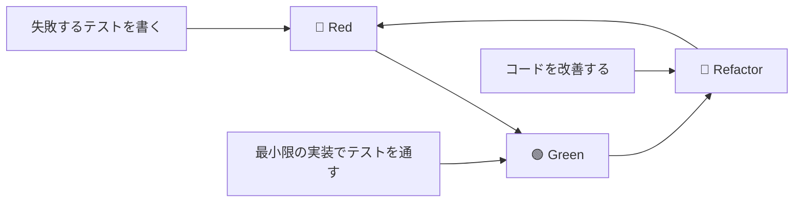

# テスト先行開発仕様書
## ドクターカー・オールインワンアプリケーション

### 1. 概要

本ドキュメントは、テスト駆動開発（TDD）アプローチを用いてドクターカーアプリを開発するための詳細な実践指針を提供します。Red-Green-Refactorサイクルを基軸とした開発プロセスと、各機能のテストファーストシナリオを定義します。

### 2. TDD基本原則

#### 2.1. Red-Green-Refactorサイクル



#### 2.2. TDD実践ルール

1. **実装前にテストを書く** - プロダクションコードより先にテストコードを書く
2. **最小限の実装** - テストを通すために必要最小限のコードのみ書く
3. **リファクタリング** - テストが通る状態でコードを改善する
4. **テストの品質維持** - テストコード自体も高品質に保つ

### 3. 開発フェーズ別TDDアプローチ

#### 3.1. Phase 1: 基盤機能（認証・型定義）

##### 3.1.1. 認証機能のTDDサイクル

**Step 1: AuthStore テストファースト開発**

```typescript
// 🔴 Red: まず失敗するテストを書く
// src/stores/__tests__/authStore.test.ts

describe('AuthStore', () => {
  test('初期状態では未認証であること', () => {
    const { result } = renderHook(() => useAuthStore());
    
    expect(result.current.isAuthenticated).toBe(false);
    expect(result.current.currentUser).toBeNull();
    expect(result.current.loading).toBe(false);
  });
  
  test('ログイン成功時に認証状態が更新されること', async () => {
    // この時点ではlogin関数は存在しない（テストが失敗する）
    const { result } = renderHook(() => useAuthStore());
    
    await act(async () => {
      await result.current.login('test@example.com', 'password');
    });
    
    expect(result.current.isAuthenticated).toBe(true);
    expect(result.current.currentUser).toBeTruthy();
  });
});
```

**Step 2: 最小限の実装**

```typescript
// 🟢 Green: テストを通すための最小実装
// src/stores/authStore.ts

interface AuthState {
  currentUser: any;
  isAuthenticated: boolean;
  loading: boolean;
  login: (email: string, password: string) => Promise<void>;
}

export const useAuthStore = create<AuthState>()((set) => ({
  currentUser: null,
  isAuthenticated: false,
  loading: false,
  
  // 最小限の実装（実際のFirebase連携は後で）
  login: async (email: string, password: string) => {
    set({
      currentUser: { email },
      isAuthenticated: true
    });
  }
}));
```

**Step 3: リファクタリング**

```typescript
// 🔵 Refactor: 型安全性と実装の改善
export interface AuthState {
  currentUser: User | null;
  isAuthenticated: boolean;
  loading: boolean;
  error: string | null;
  login: (email: string, password: string) => Promise<void>;
}

// 実際のFirebase連携実装
// エラーハンドリングの追加
// 型安全性の向上
```

#### 3.2. Phase 2: サービス層（Firebase連携）

##### 3.2.1. FirebaseサービスのTDDサイクル

**テスト駆動でのサービス開発順序**

1. **Mock → 実装 → 統合** のサイクル
2. **単体テスト → 統合テスト → E2Eテスト** の段階的検証

**例: CaseService のTDD開発**

```typescript
// 🔴 Red: サービスのインターフェーステスト
// src/services/__tests__/caseService.test.ts

describe('CaseService', () => {
  test('getAllCases: 事案一覧取得が正常に動作すること', async () => {
    // Firebase モック設定
    const mockCases = [
      { id: '1', caseName: 'Test Case 1', status: 'on_scene' },
      { id: '2', caseName: 'Test Case 2', status: 'completed' }
    ];
    
    mockFirestore.collection().get.mockResolvedValue({
      docs: mockCases.map(case_ => ({
        id: case_.id,
        data: () => case_
      }))
    });
    
    const result = await getAllCases();
    
    expect(result).toHaveLength(2);
    expect(result[0]).toMatchObject(mockCases[0]);
  });
  
  test('getCaseById: 特定事案取得が正常に動作すること', async () => {
    // まだgetCaseById関数は存在しない
    const mockCase = { id: '1', caseName: 'Test Case', status: 'on_scene' };
    
    mockFirestore.doc().get.mockResolvedValue({
      exists: true,
      id: '1',
      data: () => mockCase
    });
    
    const result = await getCaseById('1');
    
    expect(result).toMatchObject(mockCase);
  });
});
```

#### 3.3. Phase 3: コンポーネント（UI層）

##### 3.3.1. コンポーネントTDD開発例

**Button コンポーネント TDDサイクル**

```typescript
// 🔴 Red: コンポーネント要件定義テスト
// src/components/common/__tests__/Button.test.tsx

describe('Button Component - TDD Development', () => {
  // 要件1: 基本的なレンダリング
  test('テキストが正常に表示されること', () => {
    render(<Button>Click me</Button>);
    expect(screen.getByText('Click me')).toBeInTheDocument();
  });
  
  // 要件2: イベントハンドリング
  test('クリック時にonClickが呼ばれること', () => {
    const handleClick = jest.fn();
    render(<Button onClick={handleClick}>Click</Button>);
    
    fireEvent.click(screen.getByText('Click'));
    expect(handleClick).toHaveBeenCalledTimes(1);
  });
  
  // 要件3: variant対応
  test('primaryバリアントが正しいスタイルを持つこと', () => {
    render(<Button variant="primary">Primary</Button>);
    expect(screen.getByRole('button')).toHaveClass('bg-blue-600');
  });
  
  // 要件4: disabled状態
  test('disabled時はクリックイベントが無効化されること', () => {
    const handleClick = jest.fn();
    render(<Button disabled onClick={handleClick}>Disabled</Button>);
    
    fireEvent.click(screen.getByText('Disabled'));
    expect(handleClick).not.toHaveBeenCalled();
  });
  
  // 要件5: loading状態
  test('loading時はローディングスピナーが表示されること', () => {
    render(<Button loading>Loading</Button>);
    expect(screen.getByRole('button')).toBeDisabled();
    // ローディングアイコンの存在確認は実装後に追加
  });
});
```

### 4. 機能別TDDシナリオ

#### 4.1. 認証機能

**開発順序とテストシナリオ**

```typescript
// TDDサイクル1: 基本認証
describe('Authentication TDD Cycle 1', () => {
  test('ユーザーがメール・パスワードでログインできること');
  test('無効な認証情報でログインが失敗すること');
  test('ログアウトが正常に動作すること');
});

// TDDサイクル2: デモ認証
describe('Authentication TDD Cycle 2', () => {
  test('ドクターカー隊員デモログインが動作すること');
  test('病院スタッフデモログインが動作すること');
  test('デモユーザーの権限が正しく設定されること');
});

// TDDサイクル3: 認証状態管理
describe('Authentication TDD Cycle 3', () => {
  test('認証状態の永続化が動作すること');
  test('トークン期限切れ時の処理が正常に動作すること');
  test('認証エラー時の適切なメッセージ表示');
});
```

#### 4.2. 事案管理機能

**段階的TDD開発**

```typescript
// Cycle 1: 基本CRUD
describe('Case Management TDD Cycle 1', () => {
  test('事案一覧の取得が正常に動作すること');
  test('特定事案の取得が正常に動作すること');
  test('事案ステータスの更新が正常に動作すること');
});

// Cycle 2: リアルタイム機能
describe('Case Management TDD Cycle 2', () => {
  test('事案データのリアルタイム更新が動作すること');
  test('複数ユーザーでの同期が正常に動作すること');
  test('ネットワーク切断・復旧時の処理が適切であること');
});

// Cycle 3: UI統合
describe('Case Management TDD Cycle 3', () => {
  test('事案一覧画面が正常に表示されること');
  test('事案詳細画面の遷移が動作すること');
  test('ユーザー権限に応じた機能制限が動作すること');
});
```

#### 4.3. バイタルサイン機能

**TDD開発ステップ**

```typescript
// Step 1: データモデル
describe('Vital Signs TDD Step 1 - Data Model', () => {
  test('バイタルサインデータの作成が正常に動作すること');
  test('バイタル値のバリデーションが動作すること');
  test('不正な値での作成が適切にエラーとなること');
});

// Step 2: ストレージ
describe('Vital Signs TDD Step 2 - Storage', () => {
  test('バイタルデータのFirestore保存が動作すること');
  test('事案IDとの関連付けが正しく動作すること');
  test('タイムスタンプの自動設定が動作すること');
});

// Step 3: リアルタイム同期
describe('Vital Signs TDD Step 3 - Real-time', () => {
  test('新しいバイタルデータの即座な同期が動作すること');
  test('複数デバイス間での同期が正常に動作すること');
  test('データ競合の適切な処理が動作すること');
});

// Step 4: UI コンポーネント
describe('Vital Signs TDD Step 4 - UI Components', () => {
  test('バイタル入力フォームが正常に表示されること');
  test('入力値のリアルタイムバリデーションが動作すること');
  test('送信成功時の適切なフィードバックが表示されること');
});

// Step 5: タイムライン表示
describe('Vital Signs TDD Step 5 - Timeline', () => {
  test('バイタルデータの時系列表示が正常に動作すること');
  test('処置データとの統合表示が動作すること');
  test('データのフィルタリング・ソート機能が動作すること');
});
```

### 5. TDDサイクル実行手順

#### 5.1. 日次TDDワークフロー

```bash
# 1. 🔴 Red フェーズ
## 新機能のテストケース作成
npm run test:watch -- --testNamePattern="新機能名"

# 2. 🟢 Green フェーズ  
## 最小限の実装でテスト通過
npm run test:watch -- --verbose

# 3. 🔵 Refactor フェーズ
## コード改善後の全テスト実行
npm run test:coverage

# 4. 統合確認
## 関連テスト全体の実行
npm run test:integration
```

#### 5.2. 機能別TDD実行例

**例: VitalSignForm コンポーネント開発**

```typescript
// 🔴 Phase 1: インターフェース定義テスト
describe('VitalSignForm - Interface Definition', () => {
  test('必要なProps型が定義されていること', () => {
    // TypeScriptコンパイルエラーが発生することを確認
    expect(() => {
      const props: VitalSignFormProps = {
        onSubmit: jest.fn(),
        onCancel: jest.fn()
      };
    }).not.toThrow();
  });
});

// 🟢 Phase 1: 最小限の型定義
interface VitalSignFormProps {
  onSubmit: (data: VitalData) => Promise<void>;
  onCancel: () => void;
}

// 🔴 Phase 2: レンダリングテスト
test('フォームフィールドが表示されること', () => {
  render(<VitalSignForm onSubmit={jest.fn()} onCancel={jest.fn()} />);
  expect(screen.getByLabelText(/心拍数/)).toBeInTheDocument();
});

// 🟢 Phase 2: 基本的なJSX構造実装
export const VitalSignForm: React.FC<VitalSignFormProps> = () => {
  return (
    <form>
      <label>心拍数 (bpm)</label>
      <input type="number" />
    </form>
  );
};

// 🔴 Phase 3: バリデーションテスト
test('無効な心拍数でエラーが表示されること', async () => {
  // バリデーション機能のテスト
});

// 🟢 Phase 3: バリデーション実装
// 🔵 Phase 3: リファクタリング（フック化、型安全性向上）
```

### 6. テスト品質指標

#### 6.1. カバレッジ目標

| 測定項目 | 目標値 | 監視レベル |
|---------|-------|-----------|
| Line Coverage | 90%以上 | 必須 |
| Branch Coverage | 85%以上 | 必須 |
| Function Coverage | 95%以上 | 必須 |
| Statement Coverage | 90%以上 | 必須 |

#### 6.2. テスト品質チェックリスト

**各TDDサイクルでの確認項目**

- [ ] **Red フェーズ**
  - [ ] テストが実際に失敗することを確認
  - [ ] テストケースが要件を正確に表現している
  - [ ] テストが読みやすく保守可能である

- [ ] **Green フェーズ**
  - [ ] 最小限の実装でテストが通過する
  - [ ] 既存のテストが破綻していない
  - [ ] 実装が要件を満たしている

- [ ] **Refactor フェーズ**
  - [ ] すべてのテストが通過し続ける
  - [ ] コードの可読性が向上している
  - [ ] 重複コードが排除されている

### 7. TDD支援ツール設定

#### 7.1. Jest Watch Mode 設定

```javascript
// jest.config.js
module.exports = {
  // TDD用のwatch設定
  watchPlugins: [
    'jest-watch-typeahead/filename',
    'jest-watch-typeahead/testname',
  ],
  
  // 高速フィードバック設定
  bail: false,
  verbose: true,
  
  // TDD専用のテスト環境
  setupFilesAfterEnv: ['<rootDir>/src/test/tdd-setup.ts'],
};
```

#### 7.2. VS Code TDD拡張設定

```json
// .vscode/settings.json
{
  "jest.autoRun": {
    "watch": true,
    "onStartup": ["all-tests"]
  },
  "jest.showCoverageOnLoad": true,
  "typescript.preferences.includePackageJsonAutoImports": "auto"
}
```

### 8. TDD実践のベストプラクティス

#### 8.1. 効果的なテストケース作成

```typescript
// ✅ Good: 具体的で読みやすいテスト
test('心拍数90、血圧120/80、SpO2 98%の有効なバイタルデータで送信成功', async () => {
  const validVitalData = {
    hr: 90,
    bp_s: 120,
    bp_d: 80,
    spo2: 98
  };
  
  await user.submitVitalForm(validVitalData);
  
  expect(mockOnSubmit).toHaveBeenCalledWith(validVitalData);
});

// ❌ Bad: 曖昧で保守しにくいテスト  
test('バイタルフォームのテスト', () => {
  // 何をテストしているかが不明確
});
```

#### 8.2. リファクタリング指針

```typescript
// 🔵 Refactor例: フック化による再利用性向上

// Before: コンポーネント内にロジック
const VitalSignForm = () => {
  const [formData, setFormData] = useState({});
  const [errors, setErrors] = useState({});
  
  const validateForm = () => { /* validation logic */ };
  const handleSubmit = () => { /* submit logic */ };
  
  return <form>{/* JSX */}</form>;
};

// After: カスタムフックに抽出
const useVitalForm = () => {
  const [formData, setFormData] = useState({});
  const [errors, setErrors] = useState({});
  
  const validateForm = useCallback(() => { /* validation logic */ }, []);
  const handleSubmit = useCallback(() => { /* submit logic */ }, []);
  
  return { formData, errors, validateForm, handleSubmit };
};

const VitalSignForm = () => {
  const { formData, errors, validateForm, handleSubmit } = useVitalForm();
  return <form>{/* JSX */}</form>;
};
```

### 9. TDD進行管理

#### 9.1. 進捗追跡テンプレート

```markdown
## TDD Progress Tracker

### [Feature Name] - [Date]

#### Red Phase ⭕
- [ ] Test case 1: [Description]
- [ ] Test case 2: [Description]
- [ ] All tests fail as expected

#### Green Phase ⭕  
- [ ] Minimal implementation
- [ ] All tests pass
- [ ] No broken existing tests

#### Refactor Phase ⭕
- [ ] Code improvement completed
- [ ] All tests still pass
- [ ] Code quality improved

#### Metrics
- Lines of code: [Before] → [After]
- Test coverage: [%]
- Execution time: [ms]
```

#### 9.2. レビューチェックポイント

**コードレビュー時のTDD確認項目**

1. **テストファースト確認**
   - テストが実装より先にコミットされているか
   - テストが要件を適切に表現しているか

2. **実装品質確認**
   - 最小限の実装で要求を満たしているか
   - オーバーエンジニアリングしていないか

3. **リファクタリング品質確認**
   - コードの可読性が向上しているか
   - 重複や複雑さが軽減されているか

この仕様に従ってTDDを実践することで、高品質で保守しやすいコードを効率的に開発できます。